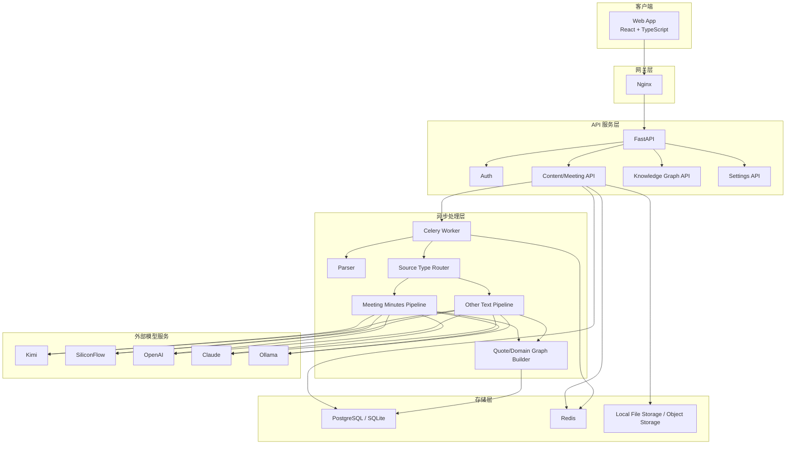

# SpeakSum 技术架构文档

**文档版本**: 2.0  
**更新日期**: 2026-04-06  
**状态**: REDESIGNED

---

## 1. 架构目标

SpeakSum 2.0 的技术架构目标是支持一个只服务 **刘彬本人** 的个人思想整理系统。

架构不再围绕“会议逐条发言处理”和“话题岛屿”展开，而是围绕以下主线展开：
- 明确区分 **会议纪要** 与 **其他文本**
- 统一产出 **发言总结**
- 提炼 **思想金句**
- 为金句绑定 **领域**
- 基于领域与金句关系构建知识图谱

---

## 2. 技术栈

### 2.1 后端

| 类别 | 选型 | 说明 |
|------|------|------|
| Web API | FastAPI | 主 API 服务 |
| ORM | SQLAlchemy 2.x | 异步 ORM |
| 数据验证 | Pydantic v2 | 请求响应和内部结构校验 |
| 任务队列 | Celery + Redis | 异步处理上传内容 |
| 数据库 | PostgreSQL | 核心业务数据 |
| 本地开发兼容 | SQLite | 本地开发与测试 |
| LLM 接入 | OpenAI-compatible abstraction | Kimi / SiliconFlow / OpenAI / Claude / Ollama / Custom |

### 2.2 前端

| 类别 | 选型 | 说明 |
|------|------|------|
| UI | React + TypeScript | 主前端应用 |
| 构建 | Vite | 本地开发与构建 |
| 状态 | Zustand | UI 状态与局部全局状态 |
| 数据获取 | TanStack Query | API 缓存与失效 |
| 组件库 | Ant Design | 基础交互组件 |
| 图谱渲染 | D3.js | 领域图谱可视化 |

---

## 3. 核心架构变化

### 3.1 从“speech pipeline”切到“summary + quote pipeline”

旧架构的问题：
- 过度依赖逐条 speech 提取与逐条加工
- 会议之外的文本无法自然纳入
- 图谱绑定的是 speech/topic，无法稳定表达长期思想资产

新架构的核心单元：
- **Content**：一条输入内容
- **Summary**：一段发言总结
- **Quote**：若干思想金句
- **Domain**：固定领域

### 3.2 从“话题图谱”切到“领域图谱”

旧图谱：
- 节点偏向 `topic` 或 `speech`
- 容易受 LLM 标签波动影响

新图谱：
- 节点固定为 `domain`
- 关系来自：
  - 同一条金句挂多个领域
  - 同一条内容中多个金句的领域共现
- 图谱稳定性更高，长期维护成本更低

---

## 4. 总体架构



---

## 5. 处理链路

### 5.1 会议纪要

```text
上传会议纪要
  -> 解析文件
  -> 识别刘彬发言
  -> 若无有效发言: ignored
  -> 若有有效发言:
       理解会议背景
       生成发言总结
       提炼思想金句
       绑定领域
  -> 保存结果
  -> 重建领域图谱
```

### 5.2 其他文本

```text
上传其他文本
  -> 解析文件
  -> 默认整份文本为刘彬本人输出
  -> 生成发言总结
  -> 提炼思想金句
  -> 绑定领域
  -> 保存结果
  -> 重建领域图谱
```

### 5.3 状态机

统一状态建议：
- `pending`
- `processing`
- `completed`
- `ignored`
- `failed`

处理阶段建议：
- `parsing`
- `identifying_speaker` 仅会议纪要使用
- `summarizing`
- `extracting_quotes`
- `building_graph`
- `ignored`
- `error`

---

## 6. LLM 架构

### 6.1 LLM 抽象层职责

LLM 客户端统一提供：
- `generate_structured_json()`
- `count_tokens()`
- `get_context_limit()`

### 6.2 Prompt 分层

必须明确区分两套 Prompt：
- `meeting_minutes`
- `other_text`

但两者返回同一个 JSON 结构：

```json
{
  "status": "completed",
  "ignored_reason": null,
  "summary": "发言总结",
  "quotes": [
    {
      "text": "思想型金句",
      "domain_ids": ["decision_method", "technology_architecture"]
    }
  ]
}
```

### 6.3 LLM 调用原则

- 默认一次调用完成总结与金句提炼
- 仅在文本过长时启用分块 + 汇总
- 会议信息的“是否忽略”只在 `meeting_minutes` 中使用
- `other_text` 不进行发言人检测

---

## 7. 知识图谱架构

### 7.1 图谱对象

图谱的基础对象：
- `Domain Node`
- `Domain Relation`
- `Quote List`

图谱不直接渲染：
- speech 节点
- viewpoint 节点

### 7.2 图谱关系来源

领域之间的关系分值来自：
- **同一金句多领域共挂**
- **同一内容中多条金句的领域共现**
- **时间邻近内容的领域共现增强**

### 7.3 图谱详情

点击某个领域，返回：
- 领域元信息
- 该领域下的思想金句列表
- 对应来源内容列表

---

## 8. API 边界

### 8.1 内容接口

- 上传内容
- 获取内容列表
- 获取内容详情
- 编辑发言总结
- 编辑/删除思想金句
- 编辑金句领域

### 8.2 图谱接口

- 获取当前用户领域图谱
- 获取领域详情
- 获取领域下的思想金句

### 8.3 设置接口

- 模型配置
- 固定主身份（刘彬）
- 领域元数据维护（低频）

---

## 9. 存储分层

### 9.1 业务层

存储内容：
- 内容主记录
- 发言总结
- 思想金句
- 金句与领域关联

### 9.2 图谱层

存储内容：
- 领域
- 领域关系
- 图谱布局缓存

### 9.3 文件层

存储内容：
- 原始上传文件
- 可选：解析后的纯文本缓存

---

## 10. 前后端职责划分

### 10.1 后端负责

- 来源类型分流
- 文件解析
- 会议纪要中的刘彬发言识别
- LLM 结果生成与 JSON 归一化
- 总结、金句、领域关系持久化
- 图谱重建

### 10.2 前端负责

- 上传来源类型选择
- 列表与详情展示
- 发言总结与金句的原地编辑
- 金句领域编辑
- 知识图谱交互与浏览

---

## 11. 架构结论

SpeakSum 2.0 的架构重点不再是“把会议拆成很多 speech 再加工”，而是：

- 根据来源类型选择处理链路
- 产出稳定的发言总结和思想金句
- 用固定领域体系承接知识图谱

这使系统同时适配：
- 多人会议纪要
- 刘彬个人文章
- 刘彬随笔笔记
- 其他长文本输入

并让知识图谱从“发言图”升级为“思想领域图”。
