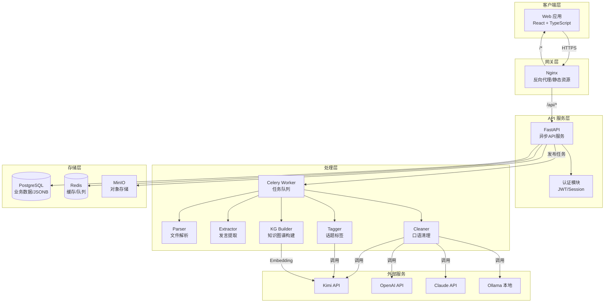
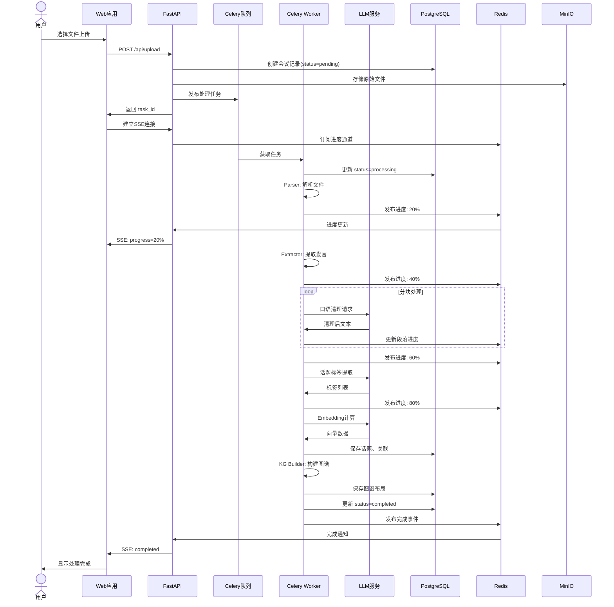

# SpeakSum 技术架构文档

**文档版本**: 1.0  
**创建日期**: 2026-04-02  
**作者**: Tech Architecture Agent  
**状态**: DRAFT

---

## 1. 技术栈确认

### 1.1 后端技术栈

| 类别 | 技术选型 | 版本 | 选择理由 |
|------|----------|------|----------|
| **编程语言** | Python | >=3.10 | 生态丰富，AI/ML库支持好，开发效率高 |
| **Web框架** | FastAPI | >=0.110 | 异步原生支持，自动API文档，类型提示友好 |
| **数据库** | PostgreSQL | >=15 | JSONB支持图数据，pgvector扩展支持向量检索 |
| **缓存** | Redis | >=7 | 任务队列、会话缓存、实时进度推送 |
| **任务队列** | Celery | >=5.3 | 成熟稳定，支持分布式任务，与FastAPI配合好 |
| **ORM** | SQLAlchemy | >=2.0 | 成熟的ORM，支持异步，类型提示完整 |
| **数据验证** | Pydantic v2 | >=2.0 | 性能优异，与FastAPI深度集成 |
| **包管理** | UV | >=0.1 | 极速依赖解析，替代pip/poetry，符合项目要求 |

### 1.2 前端技术栈

| 类别 | 技术选型 | 版本 | 选择理由 |
|------|----------|------|----------|
| **框架** | React | >=18.2 | 生态成熟，组件化开发，社区活跃 |
| **构建工具** | Vite | >=5.0 | 极速开发服务器，现代化构建 |
| **类型系统** | TypeScript | >=5.3 | 类型安全，IDE支持好，减少运行时错误 |
| **UI组件库** | Ant Design | >=5.0 | 企业级组件，中文支持好，文档完善 |
| **状态管理** | Zustand | >=4.4 | 轻量简洁，无样板代码，TypeScript友好 |
| **数据获取** | TanStack Query | >=5.0 | 缓存、重试、实时更新，REST API友好 |
| **图表可视化** | D3.js + ECharts | D3>=7, ECharts>=5 | D3用于知识图谱自定义布局，ECharts用于统计图表 |
| **HTTP客户端** | Axios | >=1.6 | 拦截器支持，请求取消，上传进度 |

### 1.3 基础设施技术栈

| 类别 | 技术选型 | 版本 | 选择理由 |
|------|----------|------|----------|
| **容器化** | Docker | >=24 | 环境一致性，便于部署扩展 |
| **编排** | Docker Compose | >=2.20 | 本地开发、单服务器部署 |
| **反向代理** | Nginx | >=1.25 | 静态资源服务、负载均衡、SSL终结 |
| **进程管理** | Supervisor | >=4.2 | 管理Celery Worker进程 |
| **监控** | Prometheus + Grafana | 最新 | 指标收集与可视化 |

### 1.4 LLM 服务集成方案

SpeakSum 支持多供应商 LLM 集成，通过统一的抽象层实现灵活切换。

#### 1.4.1 支持的 LLM 供应商

| 供应商 | 默认模型 | 上下文长度 | 特点 | 优先级 |
|--------|----------|------------|------|--------|
| **Kimi (Moonshot)** | moonshot-v1-128k | 128K | 中文优化，长上下文，性价比高 | 默认 |
| **OpenAI** | gpt-4-turbo | 128K | 能力强，稳定性高 | 备选1 |
| **Claude (Anthropic)** | claude-3-sonnet | 200K | 推理能力强，超长上下文 | 备选2 |
| **Ollama** | 本地部署 | 可变 | 隐私保护，离线可用 | 本地 |
| **自定义** | OpenAI兼容API | 可变 | 适配私有化部署 | 扩展 |

#### 1.4.2 LLM 抽象层架构

```
┌─────────────────────────────────────────────────────────────┐
│                    LLM Provider Manager                      │
├─────────────────────────────────────────────────────────────┤
│  ┌──────────────┐ ┌──────────────┐ ┌──────────────┐        │
│  │ Kimi Client  │ │OpenAI Client │ │Claude Client │        │
│  └──────┬───────┘ └──────┬───────┘ └──────┬───────┘        │
│         │                │                │                │
│         └────────────────┼────────────────┘                │
│                          ▼                                 │
│              ┌─────────────────────────┐                   │
│              │    Unified LLM Client   │                   │
│              │  - generate()           │                   │
│              │  - embed()              │                   │
│              │  - count_tokens()       │                   │
│              │  - get_context_limit()  │                   │
│              └─────────────────────────┘                   │
└─────────────────────────────────────────────────────────────┘
```

#### 1.4.3 关键 LLM 调用场景

| 场景 | 使用模型 | 调用方式 | 预估成本 |
|------|----------|----------|----------|
| 口语清理 | Kimi 128K | 分块并行调用 | ¥0.02-0.05/千字 |
| 金句提炼 | Kimi 128K | 逐段调用 | ¥0.01-0.03/千字 |
| 话题标签提取 | Kimi 128K | 批量调用 | ¥0.01-0.02/千字 |
| 标签标准化 | Kimi 128K | 整会议调用 | ¥0.01/会议 |
| Embedding 计算 | text-embedding-3 | 话题去重后调用 | ¥0.001/话题 |
| 情感分析 | Kimi 128K | 批量调用 | ¥0.005/千字 |

### 1.5 第三方依赖清单

#### 后端核心依赖

```toml
[project.dependencies]
# Web框架
fastapi = ">=0.110.0"
uvicorn = {version = ">=0.27.0", extras = ["standard"]}
python-multipart = ">=0.0.9"

# 数据库
sqlalchemy = {version = ">=2.0.0", extras = ["asyncio"]}
asyncpg = ">=0.29.0"
alembic = ">=1.13.0"
pgvector = ">=0.2.0"

# 任务队列
celery = {version = ">=5.3.0", extras = ["redis"]}
redis = ">=5.0.0"

# LLM客户端
openai = ">=1.12.0"
anthropic = ">=0.18.0"
httpx = ">=0.27.0"

# 数据验证与序列化
pydantic = ">=2.6.0"
pydantic-settings = ">=2.1.0"

# 文件解析
python-docx = ">=1.1.0"
python-magic = ">=0.4.27"
chardet = ">=5.2.0"

# 认证与安全
python-jose = {version = ">=3.3.0", extras = ["cryptography"]}
passlib = {version = ">=1.7.4", extras = ["bcrypt"]}
python-dotenv = ">=1.0.0"

# 工具库
python-dateutil = ">=2.8.2"
structlog = ">=24.1.0"
```

#### 前端核心依赖

```json
{
  "dependencies": {
    "react": "^18.2.0",
    "react-dom": "^18.2.0",
    "react-router-dom": "^6.22.0",
    "@types/react": "^18.2.0",
    "@types/react-dom": "^18.2.0",
    "antd": "^5.14.0",
    "@ant-design/icons": "^5.3.0",
    "@ant-design/pro-components": "^2.6.0",
    "zustand": "^4.5.0",
    "@tanstack/react-query": "^5.20.0",
    "axios": "^1.6.0",
    "d3": "^7.8.0",
    "echarts": "^5.5.0",
    "echarts-for-react": "^3.0.0",
    "@types/d3": "^7.4.0",
    "dayjs": "^1.11.0",
    "lodash-es": "^4.17.0",
    "@types/lodash-es": "^4.17.0"
  },
  "devDependencies": {
    "vite": "^5.1.0",
    "typescript": "^5.3.0",
    "eslint": "^8.56.0",
    "prettier": "^3.2.0"
  }
}
```

---

## 2. 系统架构图

### 2.1 整体架构概览



### 2.2 分层架构详解

#### 2.2.1 客户端层 (Client Layer)

| 组件 | 职责 | 技术 |
|------|------|------|
| Web 应用 | 用户交互界面 | React + TypeScript |
| 状态管理 | 全局状态、用户会话 | Zustand |
| HTTP客户端 | API请求、文件上传 | Axios |
| 图表库 | 知识图谱可视化 | D3.js + ECharts |

#### 2.2.2 网关层 (Gateway Layer)

| 组件 | 职责 | 技术 |
|------|------|------|
| Nginx | 反向代理、负载均衡、SSL | Nginx |
| 静态资源 | 前端构建产物 | Nginx |
| 文件上传 | 大文件分片上传 | Nginx + FastAPI |

#### 2.2.3 API 服务层 (API Layer)

| 模块 | 职责 | 端点前缀 |
|------|------|----------|
| 认证模块 | 注册/登录/Token刷新 | `/api/auth/*` |
| 会议模块 | 会议CRUD、列表查询 | `/api/meetings/*` |
| 上传模块 | 文件上传、预处理 | `/api/upload/*` |
| 处理模块 | 任务状态、进度查询 | `/api/process/*` |
| 图谱模块 | 知识图谱数据获取 | `/api/graph/*` |
| 用户模块 | 个人设置、模型配置 | `/api/users/*` |
| SSE模块 | 实时进度推送 | `/api/stream/*` |

#### 2.2.4 处理层 (Processing Layer)

| 组件 | 职责 | 输入 | 输出 |
|------|------|------|------|
| Parser | 文件解析 | 原始文件 | 结构化文本 |
| Extractor | 发言提取 | 结构化文本 | 发言列表 |
| Cleaner | 口语清理 | 原始发言 | 清理后文本 |
| Tagger | 话题标签 | 清理后文本 | 标签列表 |
| KG Builder | 知识图谱构建 | 标签+发言 | 图谱数据 |

#### 2.2.5 存储层 (Storage Layer)

| 组件 | 数据类型 | 用途 |
|------|----------|------|
| PostgreSQL | 关系数据 | 用户、会议、发言、话题 |
| PostgreSQL JSONB | 图谱结构 | 节点、边、布局 |
| pgvector | 向量 | 话题Embedding |
| Redis | 键值 | 会话、缓存、任务状态 |
| Redis List | 队列 | Celery任务队列 |
| MinIO | 对象 | 原始文件存储 |

### 2.3 组件间接口定义

#### 2.3.1 API 服务层 ↔ 处理层接口

```python
# 任务发布接口
class TaskPublisher:
    async def publish_processing_task(
        meeting_id: str,
        file_path: str,
        speaker_identity: str,
        model_config: ModelConfig
    ) -> str:  # 返回 task_id
        """发布会议处理任务到Celery队列"""
        pass

# 进度查询接口
class ProgressTracker:
    async def get_progress(task_id: str) -> ProcessingProgress:
        """获取任务处理进度"""
        pass
    
    async def subscribe_progress(task_id: str) -> AsyncIterator[ProgressEvent]:
        """SSE订阅进度更新"""
        pass
```

#### 2.3.2 处理层 ↔ 存储层接口

```python
# 数据访问接口
class MeetingRepository:
    async def create(self, meeting: MeetingCreate) -> Meeting
    async def get_by_id(self, id: str) -> Meeting | None
    async def update_status(self, id: str, status: ProcessingStatus)
    async def list_by_user(self, user_id: str, pagination: Pagination) -> list[Meeting]

class SpeechRepository:
    async def batch_create(self, speeches: list[SpeechCreate])
    async def get_by_meeting(self, meeting_id: str) -> list[Speech]
    async def update_topics(self, speech_id: str, topics: list[str])

class TopicRepository:
    async def get_or_create(self, name: str, user_id: str) -> Topic
    async def update_embedding(self, topic_id: str, embedding: list[float])
    async def find_similar(self, embedding: list[float], threshold: float) -> list[Topic]
```

#### 2.3.3 处理层 ↔ LLM 服务接口

```python
# LLM 统一接口
class LLMClient(ABC):
    @abstractmethod
    async def generate(
        self,
        messages: list[Message],
        temperature: float = 0.7,
        max_tokens: int | None = None
    ) -> str
    
    @abstractmethod
    async def embed(self, text: str) -> list[float]
    
    @abstractmethod
    def count_tokens(self, text: str) -> int
    
    @abstractmethod
    def get_context_limit(self) -> int

# 具体实现
class KimiClient(LLMClient): ...
class OpenAIClient(LLMClient): ...
class ClaudeClient(LLMClient): ...
class OllamaClient(LLMClient): ...
```

### 2.4 数据流图

#### 2.4.1 会议处理完整数据流



---

## 3. 前端架构

### 3.1 前端框架选型

| 框架 | 版本 | 选择理由 |
|------|------|----------|
| **React** | 18.2+ | 组件化、虚拟DOM、生态丰富 |
| **Vite** | 5.0+ | 极速HMR、现代化构建、Tree-shaking |
| **TypeScript** | 5.3+ | 类型安全、IDE支持、减少Bug |

### 3.2 组件结构

```
src/
├── components/              # 可复用组件
│   ├── common/             # 通用组件
│   │   ├── Header.tsx      # 顶部导航
│   │   ├── Sidebar.tsx     # 侧边栏
│   │   ├── UploadButton.tsx # 上传按钮
│   │   └── ErrorBoundary.tsx # 错误边界
│   ├── meeting/            # 会议相关
│   │   ├── MeetingCard.tsx    # 会议卡片
│   │   ├── MeetingList.tsx    # 会议列表
│   │   ├── SpeechItem.tsx     # 发言项
│   │   └── SpeechTimeline.tsx # 发言时间线
│   ├── graph/              # 知识图谱
│   │   ├── KnowledgeGraph.tsx # 知识图谱画布
│   │   ├── TopicIsland.tsx    # 话题岛屿
│   │   ├── SpeechNode.tsx     # 发言节点
│   │   ├── GraphControls.tsx  # 图谱控制栏
│   │   └── DetailPanel.tsx    # 详情面板
│   └── upload/             # 上传相关
│       ├── UploadArea.tsx     # 上传区域
│       ├── UploadProgress.tsx # 上传进度
│       ├── ProcessingSteps.tsx # 处理步骤
│       └── ConfigForm.tsx     # 配置表单
├── pages/                  # 页面组件
│   ├── Home.tsx            # 首页
│   ├── Timeline.tsx        # 会议时间线
│   ├── Graph.tsx           # 知识图谱
│   ├── Upload.tsx          # 上传页面
│   ├── Profile.tsx         # 用户中心
│   └── Settings.tsx        # 设置页面
├── hooks/                  # 自定义Hooks
│   ├── useAuth.ts          # 认证相关
│   ├── useMeetings.ts      # 会议数据
│   ├── useGraph.ts         # 图谱数据
│   ├── useUpload.ts        # 上传逻辑
│   └── useSSE.ts           # SSE实时推送
├── stores/                 # 状态管理(Zustand)
│   ├── authStore.ts        # 认证状态
│   ├── meetingStore.ts     # 会议状态
│   ├── graphStore.ts       # 图谱状态
│   └── uiStore.ts          # UI状态
├── services/               # API服务
│   ├── api.ts              # Axios实例
│   ├── authApi.ts          # 认证API
│   ├── meetingApi.ts       # 会议API
│   ├── uploadApi.ts        # 上传API
│   └── graphApi.ts         # 图谱API
├── utils/                  # 工具函数
│   ├── formatters.ts       # 格式化
│   ├── graphLayout.ts      # 图谱布局算法
│   └── validators.ts       # 验证器
└── types/                  # TypeScript类型
    ├── api.ts              # API类型
    ├── meeting.ts          # 会议类型
    ├── graph.ts            # 图谱类型
    └── user.ts             # 用户类型
```

### 3.3 状态管理方案

#### 3.3.1 状态分层

| 层级 | 状态类型 | 存储方式 | 示例 |
|------|----------|----------|------|
| **服务端状态** | 远程数据 | TanStack Query | 会议列表、图谱数据 |
| **全局状态** | 跨组件共享 | Zustand | 用户信息、当前视图 |
| **局部状态** | 组件内部 | useState | 表单输入、弹窗开关 |
| **URL状态** | 路由参数 | React Router | 筛选条件、分页 |

#### 3.3.2 Zustand Store 定义

```typescript
// stores/authStore.ts
interface AuthState {
  user: User | null;
  token: string | null;
  isAuthenticated: boolean;
  login: (email: string, password: string) => Promise<void>;
  logout: () => void;
  checkAuth: () => Promise<void>;
}

// stores/meetingStore.ts
interface MeetingState {
  currentMeeting: Meeting | null;
  selectedSpeaker: string;
  viewMode: 'timeline' | 'detail';
  setCurrentMeeting: (meeting: Meeting | null) => void;
  setSelectedSpeaker: (speaker: string) => void;
}

// stores/graphStore.ts
interface GraphState {
  layout: GraphLayout;
  selectedTopic: Topic | null;
  selectedSpeech: Speech | null;
  zoom: number;
  pan: { x: number; y: number };
  updateLayout: (layout: GraphLayout) => void;
  selectTopic: (topic: Topic | null) => void;
  setZoom: (zoom: number) => void;
}
```

### 3.4 知识图谱可视化方案

#### 3.4.1 技术选型：D3.js + Canvas

| 方案 | 优点 | 缺点 | 结论 |
|------|------|------|------|
| **D3.js + Canvas** | 性能高、定制性强 | 学习曲线陡峭 | **选择** |
| ECharts Graph | 开箱即用、配置简单 | 定制性有限 | 备选 |
| Cytoscape.js | 专业图可视化 | 包体积大 | 备选 |
| React Flow | React友好 | 更适合流程图 | 不适用 |

#### 3.4.2 可视化架构

```
┌─────────────────────────────────────────────────────────────┐
│                    KnowledgeGraph Component                  │
├─────────────────────────────────────────────────────────────┤
│                                                              │
│  ┌──────────────┐  ┌──────────────┐  ┌──────────────┐      │
│  │ GraphCanvas  │  │ GraphControls│  │ DetailPanel  │      │
│  │  (D3+Canvas) │  │  (缩放/重置)  │  │  (详情展示)   │      │
│  └──────┬───────┘  └──────────────┘  └──────────────┘      │
│         │                                                    │
│         ▼                                                    │
│  ┌─────────────────────────────────────────────────────┐   │
│  │                  D3 Force Simulation                   │   │
│  │  • Topic Nodes: 岛屿中心                               │   │
│  │  • Speech Nodes: 发言节点（岛内按时间排列）              │   │
│  │  • Topic Links: 话题关联线                             │   │
│  │  • Time Links: 时序连接线（岛内）                       │   │
│  └─────────────────────────────────────────────────────┘   │
│                                                              │
│  ┌─────────────────────────────────────────────────────┐   │
│  │                  Interaction Layer                     │   │
│  │  • 拖拽: 移动节点/画布                                  │   │
│  │  • 缩放: 滚轮/双击                                      │   │
│  │  • 点击: 选中节点/关联                                  │   │
│  │  • 悬停: 高亮关联节点                                   │   │
│  └─────────────────────────────────────────────────────┘   │
│                                                              │
└─────────────────────────────────────────────────────────────┘
```

#### 3.4.3 渲染策略

```typescript
// 分层渲染策略
interface RenderLayers {
  // 第一层: 话题关联线 (最底层)
  topicLinks: SVGLineElement[];
  
  // 第二层: 话题岛屿背景
  topicIslands: SVGCircleElement[];
  
  // 第三层: 话题标签
  topicLabels: SVGTextElement[];
  
  // 第四层: 时序连接线
  timeLinks: SVGPathElement[];
  
  // 第五层: 发言节点
  speechNodes: SVGCircleElement[];
  
  // 第六层: 发言摘要 (hover显示)
  speechLabels: SVGTextElement[];
}

// 性能优化
const renderOptimization = {
  // 视口裁剪
  viewportCulling: true,
  
  // 虚拟滚动 (大量节点时)
  virtualScrolling: {
    enabled: true,
    threshold: 200  // 超过200个节点启用
  },
  
  // 层级LOD
  lod: {
    far: { showNodes: false, showLabels: false },
    medium: { showNodes: true, showLabels: false },
    close: { showNodes: true, showLabels: true }
  }
};
```

---

## 4. 部署架构

### 4.1 开发环境配置

```yaml
# docker-compose.dev.yml
version: '3.8'
services:
  api:
    build:
      context: ./backend
      dockerfile: Dockerfile.dev
    volumes:
      - ./backend:/app
    ports:
      - "8000:8000"
    environment:
      - DATABASE_URL=postgresql://postgres:postgres@db:5432/speaksum
      - REDIS_URL=redis://redis:6379/0
      - DEBUG=true
    depends_on:
      - db
      - redis

  web:
    build:
      context: ./frontend
      dockerfile: Dockerfile.dev
    volumes:
      - ./frontend:/app
      - /app/node_modules
    ports:
      - "5173:5173"
    environment:
      - VITE_API_URL=http://localhost:8000

  db:
    image: postgres:15-alpine
    environment:
      - POSTGRES_USER=postgres
      - POSTGRES_PASSWORD=postgres
      - POSTGRES_DB=speaksum
    volumes:
      - postgres_data:/var/lib/postgresql/data
    ports:
      - "5432:5432"

  redis:
    image: redis:7-alpine
    ports:
      - "6379:6379"

  worker:
    build:
      context: ./backend
      dockerfile: Dockerfile.dev
    command: celery -A speaksum worker --loglevel=info
    volumes:
      - ./backend:/app
    environment:
      - DATABASE_URL=postgresql://postgres:postgres@db:5432/speaksum
      - REDIS_URL=redis://redis:6379/0
    depends_on:
      - db
      - redis

volumes:
  postgres_data:
```

### 4.2 生产环境部署方案

#### 4.2.1 单机部署 (适合初期)

```yaml
# docker-compose.prod.yml
version: '3.8'
services:
  nginx:
    image: nginx:alpine
    ports:
      - "80:80"
      - "443:443"
    volumes:
      - ./nginx/nginx.conf:/etc/nginx/nginx.conf
      - ./nginx/ssl:/etc/nginx/ssl
      - ./frontend/dist:/usr/share/nginx/html
    depends_on:
      - api

  api:
    image: speaksum/api:latest
    environment:
      - DATABASE_URL=${DATABASE_URL}
      - REDIS_URL=${REDIS_URL}
      - SECRET_KEY=${SECRET_KEY}
      - KIMI_API_KEY=${KIMI_API_KEY}
    depends_on:
      - db
      - redis
    deploy:
      replicas: 2

  worker:
    image: speaksum/api:latest
    command: celery -A speaksum worker --concurrency=4 --loglevel=info
    environment:
      - DATABASE_URL=${DATABASE_URL}
      - REDIS_URL=${REDIS_URL}
      - KIMI_API_KEY=${KIMI_API_KEY}
    depends_on:
      - db
      - redis
    deploy:
      replicas: 2

  db:
    image: postgres:15-alpine
    environment:
      - POSTGRES_USER=${DB_USER}
      - POSTGRES_PASSWORD=${DB_PASSWORD}
      - POSTGRES_DB=${DB_NAME}
    volumes:
      - postgres_data:/var/lib/postgresql/data
      - ./init-scripts:/docker-entrypoint-initdb.d

  redis:
    image: redis:7-alpine
    volumes:
      - redis_data:/data

  minio:
    image: minio/minio
    command: server /data --console-address ":9001"
    environment:
      - MINIO_ROOT_USER=${MINIO_USER}
      - MINIO_ROOT_PASSWORD=${MINIO_PASSWORD}
    volumes:
      - minio_data:/data

volumes:
  postgres_data:
  redis_data:
  minio_data:
```

#### 4.2.2 Kubernetes 部署 (适合规模扩展)

```yaml
# k8s/api-deployment.yaml
apiVersion: apps/v1
kind: Deployment
metadata:
  name: speaksum-api
spec:
  replicas: 3
  selector:
    matchLabels:
      app: speaksum-api
  template:
    metadata:
      labels:
        app: speaksum-api
    spec:
      containers:
      - name: api
        image: speaksum/api:latest
        ports:
        - containerPort: 8000
        env:
        - name: DATABASE_URL
          valueFrom:
            secretKeyRef:
              name: speaksum-secrets
              key: database-url
        - name: KIMI_API_KEY
          valueFrom:
            secretKeyRef:
              name: speaksum-secrets
              key: kimi-api-key
        resources:
          requests:
            memory: "256Mi"
            cpu: "250m"
          limits:
            memory: "512Mi"
            cpu: "500m"
        livenessProbe:
          httpGet:
            path: /health
            port: 8000
          initialDelaySeconds: 30
          periodSeconds: 10
```

### 4.3 Docker 容器化

#### 4.3.1 后端 Dockerfile

```dockerfile
# backend/Dockerfile
FROM python:3.11-slim as builder

WORKDIR /app

# 安装uv
RUN pip install uv

# 复制依赖定义
COPY pyproject.toml uv.lock ./

# 导出requirements并安装
RUN uv export --no-dev > requirements.txt
RUN pip install --no-cache-dir -r requirements.txt

# 生产镜像
FROM python:3.11-slim

WORKDIR /app

# 复制已安装的依赖
COPY --from=builder /usr/local/lib/python3.11/site-packages /usr/local/lib/python3.11/site-packages
COPY --from=builder /usr/local/bin /usr/local/bin

# 复制应用代码
COPY src/ ./src/

# 非root用户运行
RUN useradd -m -u 1000 appuser
USER appuser

EXPOSE 8000

CMD ["uvicorn", "speaksum.main:app", "--host", "0.0.0.0", "--port", "8000"]
```

#### 4.3.2 前端 Dockerfile

```dockerfile
# frontend/Dockerfile
FROM node:20-alpine as builder

WORKDIR /app

COPY package.json package-lock.json ./
RUN npm ci

COPY . .
RUN npm run build

# 生产环境使用nginx
FROM nginx:alpine
COPY --from=builder /app/dist /usr/share/nginx/html
COPY nginx.conf /etc/nginx/conf.d/default.conf

EXPOSE 80
CMD ["nginx", "-g", "daemon off;"]
```

---

## 5. 技术风险与缓解

### 5.1 主要技术风险识别

| 风险编号 | 风险描述 | 影响等级 | 可能性 |
|----------|----------|----------|--------|
| R1 | LLM 服务不稳定/不可用 | 高 | 中 |
| R2 | 长文本处理超时/失败 | 高 | 中 |
| R3 | 知识图谱渲染性能问题 | 中 | 中 |
| R4 | 多租户数据隔离漏洞 | 高 | 低 |
| R5 | API 成本超预算 | 中 | 高 |
| R6 | 文件解析安全风险 | 高 | 中 |
| R7 | 并发处理资源耗尽 | 中 | 中 |

### 5.2 应对方案

#### R1: LLM 服务不稳定

| 缓解措施 | 优先级 | 实现方式 |
|----------|--------|----------|
| 多供应商备份 | P0 | 主(Kimi)失败自动切换至次(OpenAI/Claude) |
| 本地模型兜底 | P1 | Ollama本地模型处理简单任务 |
| 熔断机制 | P0 | 连续失败3次触发熔断，30分钟后恢复 |
| 指数退避重试 | P0 | 失败时1s, 2s, 4s, 8s退避重试 |
| 队列积压告警 | P1 | Redis队列长度>100触发告警 |

#### R2: 长文本处理超时

| 缓解措施 | 优先级 | 实现方式 |
|----------|--------|----------|
| 智能分块 | P0 | 超过阈值自动分块，每块独立处理 |
| 断点续传 | P1 | 记录处理进度，失败后可恢复 |
| 超时控制 | P0 | 单块处理超时5分钟，整体超时30分钟 |
| 降级策略 | P1 | 超时后跳过清理，保留原始文本 |

#### R3: 图谱渲染性能

| 缓解措施 | 优先级 | 实现方式 |
|----------|--------|----------|
| 视口裁剪 | P0 | 只渲染可见区域节点 |
| 节点聚合 | P1 | 超过100节点时，密集区域聚合显示 |
| Canvas渲染 | P0 | 使用Canvas代替SVG，提升性能 |
| Web Worker | P1 | 布局计算在Worker线程执行 |

#### R4: 数据隔离安全

| 缓解措施 | 优先级 | 实现方式 |
|----------|--------|----------|
| JWT验证 | P0 | 所有API请求必须携带有效Token |
| 行级安全 | P0 | 数据库查询强制添加user_id过滤 |
| 接口鉴权 | P0 | 每个接口验证资源访问权限 |
| 审计日志 | P1 | 记录敏感操作日志 |

#### R5: API 成本控制

| 缓解措施 | 优先级 | 实现方式 |
|----------|--------|----------|
| 用量配额 | P0 | 单用户月限额，超限时提示 |
| 缓存策略 | P1 | 相同文本Embedding结果缓存30天 |
| 预估显示 | P1 | 上传前显示预估费用 |
| 降级模型 | P1 | 超预算时切换至本地/便宜模型 |

#### R6: 文件解析安全

| 缓解措施 | 优先级 | 实现方式 |
|----------|--------|----------|
| 文件类型白名单 | P0 | 只允许.txt/.md/.doc/.docx |
| 文件大小限制 | P0 | 单文件最大10MB |
| 沙箱解析 | P1 | 使用docker隔离解析过程 |
| 内容消毒 | P0 | 过滤潜在的XSS/注入内容 |

#### R7: 并发资源耗尽

| 缓解措施 | 优先级 | 实现方式 |
|----------|--------|----------|
| 限流控制 | P0 | 单用户并发处理最多3个文件 |
| 队列长度限制 | P0 | 全局队列最大1000个任务 |
| 资源监控 | P1 | CPU/内存使用率>80%触发告警 |
| 自动扩容 | P2 | Worker数量根据队列长度自动调整 |

### 5.3 备选技术栈

| 组件 | 主选方案 | 备选方案 | 切换触发条件 |
|------|----------|----------|--------------|
| Web框架 | FastAPI | Django + DRF | 需要Admin后台时 |
| 数据库 | PostgreSQL | PostgreSQL + Neo4j | 图谱查询复杂化时 |
| 缓存 | Redis | KeyDB | 需要更高性能时 |
| 任务队列 | Celery | RQ / ARQ | Celery复杂度过高时 |
| 前端状态 | Zustand | Redux Toolkit | 状态逻辑复杂化时 |
| 图谱渲染 | D3.js | Cytoscape.js | D3定制成本过高时 |

---

## 附录

### A. 架构决策记录

| 日期 | 决策 | 原因 | 替代方案 |
|------|------|------|----------|
| 2026-04-02 | FastAPI作为Web框架 | 异步原生、性能高、文档自动生成 | Django |
| 2026-04-02 | PostgreSQL + pgvector | 统一存储、减少运维、向量支持 | PostgreSQL + Neo4j |
| 2026-04-02 | Celery任务队列 | 成熟稳定、生态丰富 | RQ |
| 2026-04-02 | React + Vite | 生态好、开发体验佳 | Vue3 |
| 2026-04-02 | D3.js图谱渲染 | 定制性强、性能可控 | ECharts |
| 2026-04-02 | SSE实时推送 | 轻量、单向推送足够 | WebSocket |

### B. 性能指标目标

| 指标 | 目标值 | 测试方法 |
|------|--------|----------|
| API响应时间(P95) | <200ms | k6压测 |
| 文件上传 | <3s(10MB) | 实测 |
| 单会议处理 | <60s(1万字) | 实测 |
| 图谱渲染 | <2s(100节点) | Lighthouse |
| 并发用户 | 100 | k6压测 |

### C. 参考资料

- [PRODUCT_DESIGN.md](./PRODUCT_DESIGN.md) - 产品设计文档
- [TECH_DESIGN.md](./TECH_DESIGN.md) - 技术设计文档
- [FastAPI官方文档](https://fastapi.tiangolo.com/)
- [Celery官方文档](https://docs.celeryq.dev/)
- [D3.js官方文档](https://d3js.org/)

---

**文档结束**
