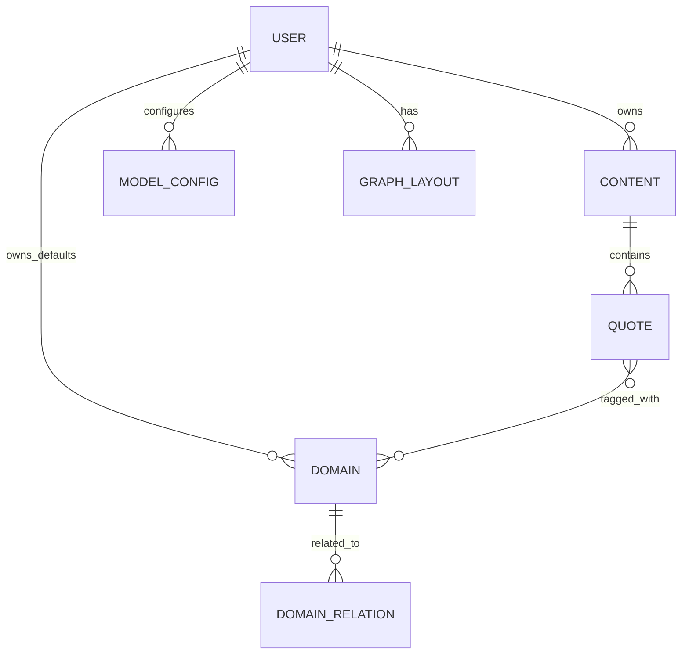
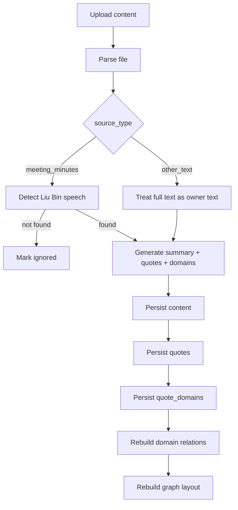

# SpeakSum 技术设计文档

**文档版本**: 2.0  
**更新日期**: 2026-04-06  
**状态**: REDESIGNED

---

## 1. 设计目标

SpeakSum 2.0 采用 **方案 A：重做主模型**。

系统不再以 `meeting -> speeches -> viewpoints -> topics` 为核心，而改为：

```text
content -> summary -> quotes -> domains
```

其中：
- `content` 是一条输入内容，来源为 `meeting_minutes` 或 `other_text`
- `summary` 是一段发言总结
- `quotes` 是思想金句
- `domains` 是稳定的预定义领域

知识图谱只依赖：
- `quotes`
- `quote_domains`
- `domain_relations`

---

## 2. 数据模型

## 2.1 核心实体



## 2.2 主表设计

### 2.2.1 `contents`

```sql
CREATE TABLE contents (
    id UUID PRIMARY KEY DEFAULT gen_random_uuid(),
    user_id UUID NOT NULL REFERENCES users(id) ON DELETE CASCADE,

    title VARCHAR(255) NOT NULL,
    source_type VARCHAR(50) NOT NULL, -- meeting_minutes | other_text
    content_date DATE,

    source_file_name VARCHAR(255),
    source_file_path TEXT,
    source_file_size INTEGER,
    file_type VARCHAR(50),

    status VARCHAR(50) NOT NULL DEFAULT 'pending',
    ignored_reason TEXT,
    error_message TEXT,

    summary_text TEXT,

    created_at TIMESTAMP WITH TIME ZONE DEFAULT NOW(),
    updated_at TIMESTAMP WITH TIME ZONE DEFAULT NOW(),
    completed_at TIMESTAMP WITH TIME ZONE
);

CREATE INDEX idx_contents_user_date ON contents(user_id, content_date DESC, created_at DESC);
CREATE INDEX idx_contents_user_status ON contents(user_id, status);
CREATE INDEX idx_contents_source_type ON contents(user_id, source_type);
```

### 2.2.2 `quotes`

```sql
CREATE TABLE quotes (
    id UUID PRIMARY KEY DEFAULT gen_random_uuid(),
    content_id UUID NOT NULL REFERENCES contents(id) ON DELETE CASCADE,
    user_id UUID NOT NULL REFERENCES users(id) ON DELETE CASCADE,
    sequence_number INTEGER NOT NULL,
    text TEXT NOT NULL,
    created_at TIMESTAMP WITH TIME ZONE DEFAULT NOW(),
    updated_at TIMESTAMP WITH TIME ZONE DEFAULT NOW()
);

CREATE INDEX idx_quotes_content_id ON quotes(content_id, sequence_number);
CREATE INDEX idx_quotes_user_id ON quotes(user_id);
```

### 2.2.3 `domains`

```sql
CREATE TABLE domains (
    id VARCHAR(100) PRIMARY KEY,
    user_id UUID NOT NULL REFERENCES users(id) ON DELETE CASCADE,
    display_name VARCHAR(100) NOT NULL,
    description TEXT,
    is_system_default BOOLEAN NOT NULL DEFAULT true,
    sort_order INTEGER NOT NULL DEFAULT 0,
    created_at TIMESTAMP WITH TIME ZONE DEFAULT NOW(),
    updated_at TIMESTAMP WITH TIME ZONE DEFAULT NOW(),
    UNIQUE(user_id, display_name)
);
```

### 2.2.4 `quote_domains`

```sql
CREATE TABLE quote_domains (
    quote_id UUID NOT NULL REFERENCES quotes(id) ON DELETE CASCADE,
    domain_id VARCHAR(100) NOT NULL REFERENCES domains(id) ON DELETE CASCADE,
    created_at TIMESTAMP WITH TIME ZONE DEFAULT NOW(),
    PRIMARY KEY (quote_id, domain_id)
);

CREATE INDEX idx_quote_domains_domain_id ON quote_domains(domain_id);
```

### 2.2.5 `domain_relations`

```sql
CREATE TABLE domain_relations (
    id UUID PRIMARY KEY DEFAULT gen_random_uuid(),
    user_id UUID NOT NULL REFERENCES users(id) ON DELETE CASCADE,
    domain_a_id VARCHAR(100) NOT NULL REFERENCES domains(id) ON DELETE CASCADE,
    domain_b_id VARCHAR(100) NOT NULL REFERENCES domains(id) ON DELETE CASCADE,
    co_occurrence_score FLOAT DEFAULT 0,
    temporal_score FLOAT DEFAULT 0,
    total_score FLOAT DEFAULT 0,
    created_at TIMESTAMP WITH TIME ZONE DEFAULT NOW(),
    updated_at TIMESTAMP WITH TIME ZONE DEFAULT NOW(),
    UNIQUE(user_id, domain_a_id, domain_b_id)
);
```

### 2.2.6 `graph_layouts`

```sql
CREATE TABLE graph_layouts (
    id UUID PRIMARY KEY DEFAULT gen_random_uuid(),
    user_id UUID NOT NULL REFERENCES users(id) ON DELETE CASCADE,
    layout_data JSONB NOT NULL DEFAULT '{}'::jsonb,
    version INTEGER NOT NULL DEFAULT 1,
    updated_at TIMESTAMP WITH TIME ZONE DEFAULT NOW()
);
```

---

## 3. 默认领域初始化

每个用户在初始化时写入以下领域：

```text
product_business
technology_architecture
delivery_execution
organization_collaboration
learning_growth
decision_method
life_values
health_fitness
next_generation_education
investing_trading
other
```

系统可以保留低频修改能力，但：
- `id` 是稳定的
- 业务关联始终使用 `id`
- 修改显示名不会触发重新计算历史金句

---

## 4. 内容来源分流

## 4.1 `meeting_minutes`

输入：
- 会议纪要文件

处理步骤：
1. 解析文本
2. 提取会议日期
3. 识别刘彬发言
4. 若未识别到，返回 `ignored`
5. 若识别到，生成总结与金句

## 4.2 `other_text`

输入：
- 文章
- 随笔
- 笔记
- 草稿

处理步骤：
1. 解析文本
2. 默认整份文本属于刘彬本人
3. 直接生成总结与金句

---

## 5. Prompt 设计

## 5.1 统一输出契约

```json
{
  "status": "completed",
  "ignored_reason": null,
  "summary": "一段发言总结",
  "quotes": [
    {
      "text": "完整表达一个观点、洞察或认知的思想型金句",
      "domain_ids": ["decision_method", "technology_architecture"]
    }
  ]
}
```

约束：
- `summary` 必须存在，建议 120-260 字
- `quotes` 默认 3-8 条
- 每条 `quote` 绑定 1-3 个 `domain_ids`
- `domain_ids` 只能从预定义领域中选择

## 5.2 会议纪要 Prompt

职责：
- 理解会议背景
- 只总结刘彬的表达
- 生成发言总结
- 提炼思想金句
- 如果没有足够证据证明刘彬发言，则返回 `ignored`

## 5.3 其他文本 Prompt

职责：
- 不做发言人判断
- 默认整份文本是刘彬本人输出
- 直接生成发言总结与思想金句

## 5.4 金句标准

金句必须满足：
- 表达明确观点、洞察、认知或方法
- 不是流程性语言
- 不是背景复述
- 不是纯情绪语句
- 可以是一句短句，也可以是 1-3 句话的小段

---

## 6. 后端处理流程



### 6.1 Celery 阶段

- `parsing`
- `identifying_speaker` 仅会议纪要
- `summarizing`
- `extracting_quotes`
- `building_graph`
- `completed / ignored / failed`

### 6.2 失败处理

- 解析失败：`failed`
- LLM 结果格式非法：`failed`
- 会议纪要未识别到刘彬发言：`ignored`
- 图谱重建失败：整条任务 `failed`

---

## 7. 知识图谱计算

## 7.1 节点

节点固定为 `domain`：

```json
{
  "id": "technology_architecture",
  "type": "domain",
  "label": "技术与架构",
  "size": 42
}
```

节点大小可由以下指标综合决定：
- 领域下金句数量
- 领域覆盖内容数量

## 7.2 边

边表示两个领域之间的关联：

```json
{
  "source": "technology_architecture",
  "target": "decision_method",
  "type": "related",
  "strength": 0.62
}
```

关联度来源：
- 同一条金句的多领域共挂
- 同一条内容中多条金句的领域共现
- 时间邻近的重复共现增强

## 7.3 详情面板

点击领域节点后返回：
- 领域信息
- 相关金句列表
- 金句来源内容摘要

---

## 8. API 设计

## 8.1 上传接口

`POST /api/v1/upload`

表单字段：
- `file`
- `source_type`
- `provider`

响应：

```json
{
  "task_id": "uuid",
  "content_id": "uuid",
  "status": "pending"
}
```

## 8.2 内容详情接口

`GET /api/v1/contents/{content_id}`

响应：

```json
{
  "id": "uuid",
  "title": "数字化专题会",
  "source_type": "meeting_minutes",
  "content_date": "2026-03-14",
  "status": "completed",
  "summary_text": "刘彬在本次会议中主要强调……",
  "quotes": [
    {
      "id": "uuid",
      "sequence_number": 1,
      "text": "先明确边界，再谈平台化扩张。",
      "domain_ids": ["technology_architecture", "decision_method"]
    }
  ]
}
```

## 8.3 内容编辑接口

- `PATCH /api/v1/contents/{content_id}/summary`
- `PATCH /api/v1/contents/{content_id}/quotes/{quote_id}`
- `DELETE /api/v1/contents/{content_id}/quotes/{quote_id}`

注意：
- 改 `summary_text` 不重建图谱
- 改 `quote.text` 不重建图谱
- 改 `quote.domain_ids` 或删除 quote 时重建图谱

## 8.4 图谱接口

- `GET /api/v1/graph`
- `GET /api/v1/graph/domains/{domain_id}`

---

## 9. 前端状态模型

前端主状态对象建议：

```ts
type SourceType = 'meeting_minutes' | 'other_text';

interface Content {
  id: string;
  title: string;
  source_type: SourceType;
  content_date: string | null;
  status: 'pending' | 'processing' | 'completed' | 'ignored' | 'failed';
  summary_text: string | null;
  ignored_reason: string | null;
  quotes: Quote[];
}

interface Quote {
  id: string;
  sequence_number: number;
  text: string;
  domain_ids: string[];
}
```

---

## 10. 迁移策略

方案 A 采用硬切主模型，因此技术上建议：
- 建立新的 `contents / quotes / quote_domains / domains / domain_relations`
- 旧的 `meetings / speeches / viewpoints / topics` 视为迁移前结构
- 旧结构可保留只读，直到数据迁移或清理完成

如果不做历史迁移，则：
- 新功能只读新表
- 旧数据不再进入新知识图谱

---

## 11. 测试重点

### 11.1 后端

- `meeting_minutes` 检测到刘彬发言 -> `completed`
- `meeting_minutes` 未检测到刘彬发言 -> `ignored`
- `other_text` 直接生成总结与金句
- LLM 输出非法 JSON -> `failed`
- 修改金句领域 -> 图谱重建
- 删除金句 -> 图谱重建

### 11.2 前端

- 上传时来源类型切换
- 时间线正确展示来源类型
- 详情页可编辑总结
- 详情页可编辑/删除金句
- 金句领域修改后图谱刷新

---

## 12. 技术结论

SpeakSum 2.0 的技术设计核心是：
- 用 `content` 统一承接会议纪要和其他文本
- 用 `summary + quote + domain` 统一承接输出
- 用 `domain graph` 统一承接知识图谱

这样产品语义、数据结构、Prompt 契约、前端页面和图谱逻辑才能保持一致。
