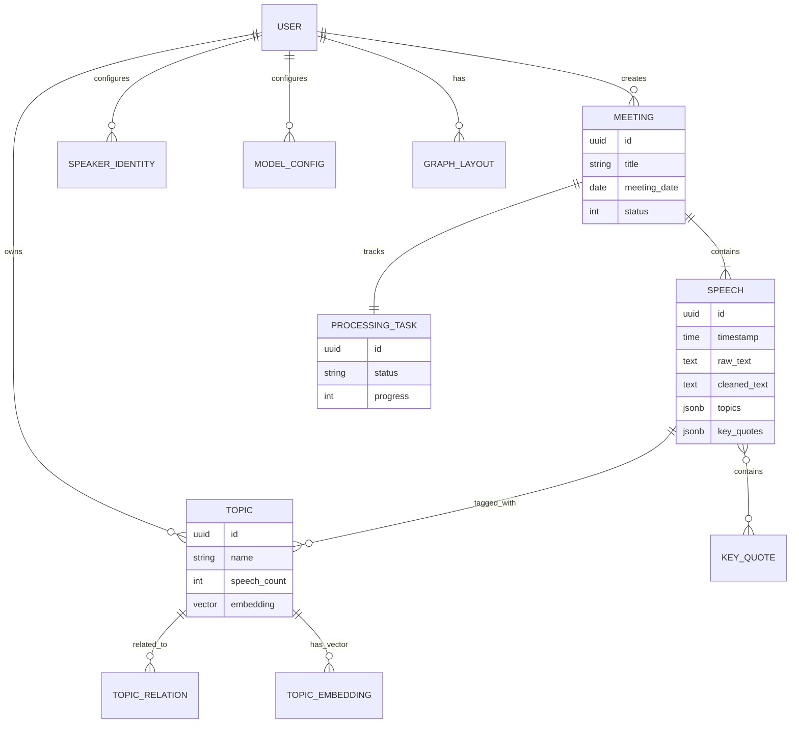
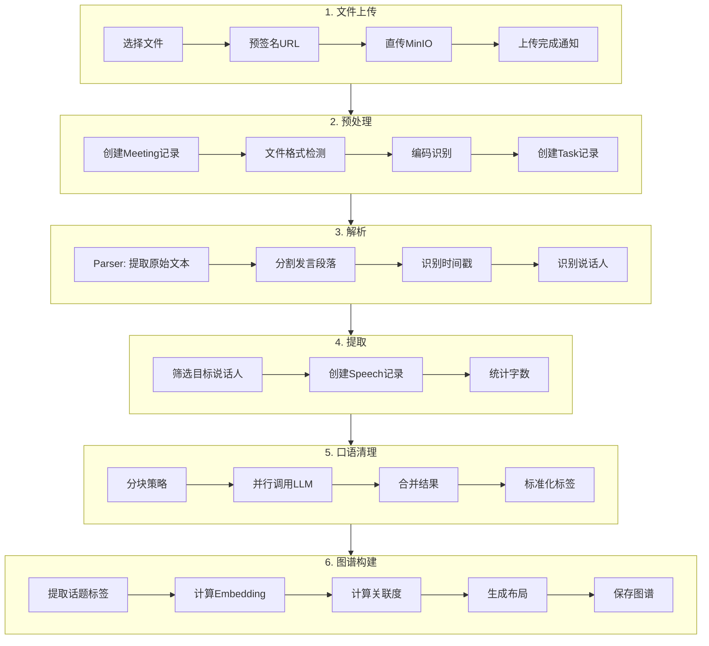
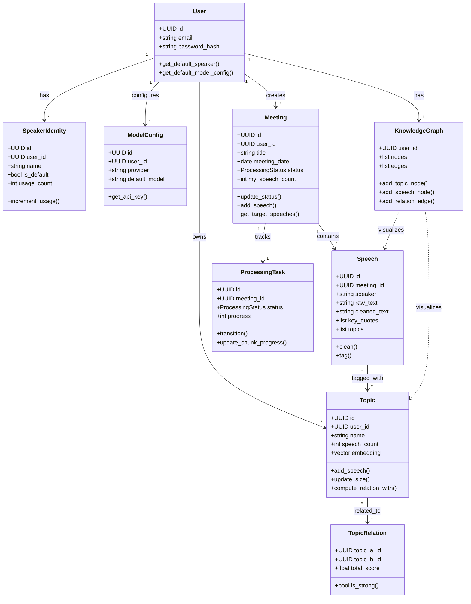
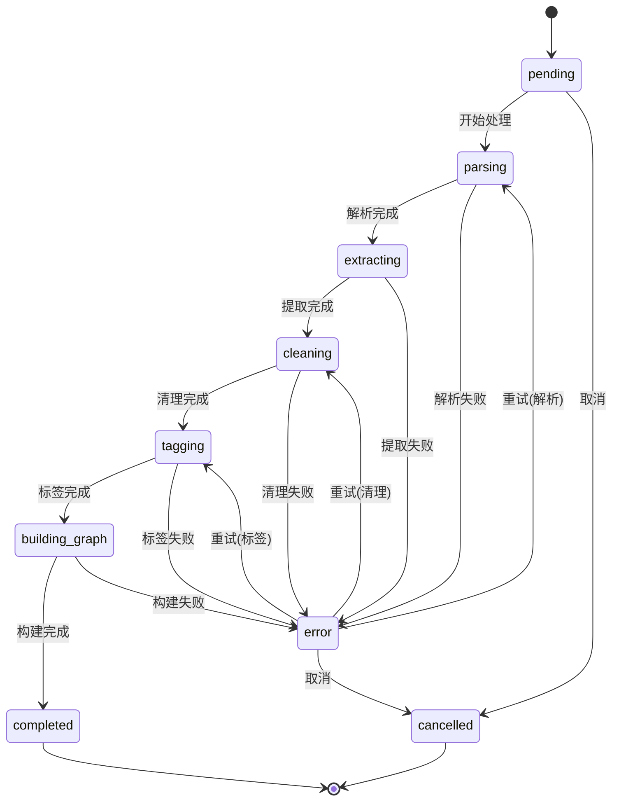
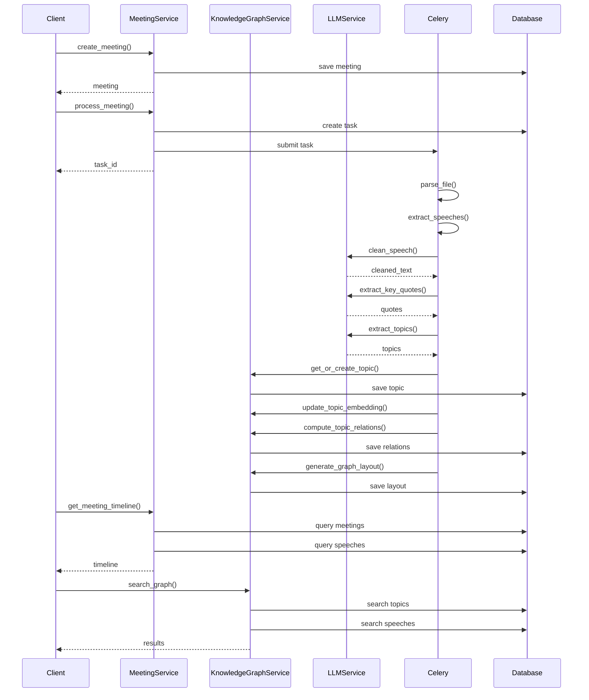

# SpeakSum 技术设计文档

**文档版本**: 1.0  
**创建日期**: 2026-04-02  
**作者**: Tech Architecture Agent  
**状态**: DRAFT

---

## 1. 数据模型设计

### 1.1 数据库选型

**选型**: PostgreSQL + pgvector 扩展

| 数据库类型 | 方案 | 选择理由 |
|------------|------|----------|
| **主数据库** | PostgreSQL 15+ | 成熟稳定，JSONB支持图数据，ACID保证 |
| **向量扩展** | pgvector | 支持向量检索，与PostgreSQL无缝集成 |
| **缓存** | Redis 7+ | 高性能缓存、任务队列、实时推送 |
| **对象存储** | MinIO | S3兼容，本地文件存储 |

### 1.2 核心实体关系图



### 1.3 完整 Schema 定义

#### 1.3.1 用户相关表

```sql
-- 用户表
CREATE TABLE users (
    id UUID PRIMARY KEY DEFAULT gen_random_uuid(),
    email VARCHAR(255) UNIQUE NOT NULL,
    password_hash VARCHAR(255) NOT NULL,
    display_name VARCHAR(100),
    avatar_url TEXT,
    is_active BOOLEAN DEFAULT true,
    created_at TIMESTAMP WITH TIME ZONE DEFAULT NOW(),
    updated_at TIMESTAMP WITH TIME ZONE DEFAULT NOW()
);

-- 用户发言身份配置表
CREATE TABLE speaker_identities (
    id UUID PRIMARY KEY DEFAULT gen_random_uuid(),
    user_id UUID NOT NULL REFERENCES users(id) ON DELETE CASCADE,
    name VARCHAR(100) NOT NULL,  -- 如: "我", "小美"
    is_default BOOLEAN DEFAULT false,
    usage_count INTEGER DEFAULT 0,
    created_at TIMESTAMP WITH TIME ZONE DEFAULT NOW(),
    UNIQUE(user_id, name)
);

-- LLM模型配置表
CREATE TABLE model_configs (
    id UUID PRIMARY KEY DEFAULT gen_random_uuid(),
    user_id UUID NOT NULL REFERENCES users(id) ON DELETE CASCADE,
    provider VARCHAR(50) NOT NULL,  -- 'kimi', 'openai', 'claude', 'ollama'
    name VARCHAR(100) NOT NULL,     -- 显示名称
    api_key_encrypted TEXT,         -- 加密存储的API Key
    base_url VARCHAR(255),          -- API基础地址
    default_model VARCHAR(100) NOT NULL,  -- 默认模型名称
    context_length INTEGER,         -- 上下文长度
    is_default BOOLEAN DEFAULT false,
    is_enabled BOOLEAN DEFAULT true,
    created_at TIMESTAMP WITH TIME ZONE DEFAULT NOW(),
    updated_at TIMESTAMP WITH TIME ZONE DEFAULT NOW()
);
```

#### 1.3.2 会议与发言表

```sql
-- 会议表
CREATE TABLE meetings (
    id UUID PRIMARY KEY DEFAULT gen_random_uuid(),
    user_id UUID NOT NULL REFERENCES users(id) ON DELETE CASCADE,
    title VARCHAR(255) NOT NULL,
    meeting_date DATE NOT NULL,
    duration_minutes INTEGER,           -- 会议时长(分钟)
    source_file_name VARCHAR(255),      -- 原始文件名
    source_file_path TEXT,              -- 文件存储路径
    source_file_size INTEGER,           -- 文件大小(字节)
    file_type VARCHAR(50),              -- txt, md, docx
    
    -- 处理状态: pending, parsing, extracting, cleaning, tagging, 
    --           building_graph, completed, error, cancelled
    status VARCHAR(50) DEFAULT 'pending',
    
    -- 统计信息
    total_speeches INTEGER DEFAULT 0,
    my_speech_count INTEGER DEFAULT 0,
    total_word_count INTEGER DEFAULT 0,
    my_word_count INTEGER DEFAULT 0,
    
    -- 元数据
    participants JSONB DEFAULT '[]',    -- 参与者列表
    processing_metadata JSONB,          -- 处理元数据
    
    created_at TIMESTAMP WITH TIME ZONE DEFAULT NOW(),
    updated_at TIMESTAMP WITH TIME ZONE DEFAULT NOW(),
    completed_at TIMESTAMP WITH TIME ZONE
);

-- 发言表
CREATE TABLE speeches (
    id UUID PRIMARY KEY DEFAULT gen_random_uuid(),
    meeting_id UUID NOT NULL REFERENCES meetings(id) ON DELETE CASCADE,
    sequence_number INTEGER NOT NULL,   -- 会议中的发言顺序
    
    -- 时间信息
    timestamp TIME,
    relative_seconds INTEGER,           -- 相对于会议开始的秒数
    
    -- 说话人
    speaker VARCHAR(100) NOT NULL,      -- 原始说话人名称
    is_target_speaker BOOLEAN DEFAULT false,  -- 是否为目标用户
    
    -- 文本内容
    raw_text TEXT NOT NULL,             -- 原始文本
    cleaned_text TEXT,                  -- 清理后文本
    word_count INTEGER,                 -- 字数
    
    -- 处理结果
    key_quotes JSONB DEFAULT '[]',      -- 金句列表
    topics JSONB DEFAULT '[]',          -- 话题标签
    sentiment VARCHAR(20),              -- positive, negative, neutral, mixed
    
    -- 图谱关联
    graph_node_id VARCHAR(100),         -- 图谱中节点ID
    graph_x FLOAT,                      -- 图谱布局X坐标
    graph_y FLOAT,                      -- 图谱布局Y坐标
    
    created_at TIMESTAMP WITH TIME ZONE DEFAULT NOW(),
    updated_at TIMESTAMP WITH TIME ZONE DEFAULT NOW()
);

-- 创建复合索引优化查询
CREATE INDEX idx_speeches_meeting_id ON speeches(meeting_id);
CREATE INDEX idx_speeches_meeting_sequence ON speeches(meeting_id, sequence_number);
CREATE INDEX idx_speeches_is_target ON speeches(meeting_id, is_target_speaker);
CREATE INDEX idx_speeches_timestamp ON speeches(meeting_id, timestamp);
CREATE INDEX idx_speeches_topics ON speeches USING GIN(topics);
CREATE INDEX idx_speeches_graph_node ON speeches(graph_node_id);
```

#### 1.3.3 话题与图谱表

```sql
-- 话题表
CREATE TABLE topics (
    id UUID PRIMARY KEY DEFAULT gen_random_uuid(),
    user_id UUID NOT NULL REFERENCES users(id) ON DELETE CASCADE,
    name VARCHAR(100) NOT NULL,         -- 话题名称
    normalized_name VARCHAR(100),       -- 标准化名称(用于去重)
    
    -- 统计信息
    speech_count INTEGER DEFAULT 0,
    meeting_count INTEGER DEFAULT 0,
    first_appearance DATE,              -- 首次出现日期
    last_appearance DATE,               -- 最近出现日期
    
    -- 图谱可视化
    graph_node_id VARCHAR(100),         -- 图谱节点ID
    graph_x FLOAT DEFAULT 0,            -- X坐标
    graph_y FLOAT DEFAULT 0,            -- Y坐标
    size FLOAT DEFAULT 1.0,             -- 岛屿大小系数
    
    created_at TIMESTAMP WITH TIME ZONE DEFAULT NOW(),
    updated_at TIMESTAMP WITH TIME ZONE DEFAULT NOW(),
    
    UNIQUE(user_id, normalized_name)
);

-- 话题向量表 (用于语义相似度计算)
CREATE TABLE topic_embeddings (
    id UUID PRIMARY KEY DEFAULT gen_random_uuid(),
    topic_id UUID NOT NULL REFERENCES topics(id) ON DELETE CASCADE,
    embedding vector(1536),             -- OpenAI text-embedding-3维度
    model_name VARCHAR(100),            -- 生成向量的模型
    created_at TIMESTAMP WITH TIME ZONE DEFAULT NOW(),
    UNIQUE(topic_id)
);

-- 创建向量索引
CREATE INDEX idx_topic_embeddings_vector ON topic_embeddings 
    USING ivfflat (embedding vector_cosine_ops);

-- 话题关联表
CREATE TABLE topic_relations (
    id UUID PRIMARY KEY DEFAULT gen_random_uuid(),
    user_id UUID NOT NULL REFERENCES users(id) ON DELETE CASCADE,
    topic_a_id UUID NOT NULL REFERENCES topics(id) ON DELETE CASCADE,
    topic_b_id UUID NOT NULL REFERENCES topics(id) ON DELETE CASCADE,
    
    -- 关联度计算
    co_occurrence_score FLOAT DEFAULT 0,    -- 共现关联度(0-1)
    temporal_score FLOAT DEFAULT 0,         -- 时间关联度(0-1)
    semantic_score FLOAT DEFAULT 0,         -- 语义关联度(0-1)
    total_score FLOAT DEFAULT 0,            -- 综合关联度(0-1)
    
    -- 关联详情
    co_occurrence_count INTEGER DEFAULT 0,  -- 共现次数
    first_co_date DATE,                     -- 首次共现日期
    last_co_date DATE,                      -- 最近共现日期
    
    created_at TIMESTAMP WITH TIME ZONE DEFAULT NOW(),
    updated_at TIMESTAMP WITH TIME ZONE DEFAULT NOW(),
    
    UNIQUE(topic_a_id, topic_b_id),
    CHECK(topic_a_id < topic_b_id)  -- 避免重复存储A-B和B-A
);

CREATE INDEX idx_topic_relations_user ON topic_relations(user_id);
CREATE INDEX idx_topic_relations_a ON topic_relations(topic_a_id);
CREATE INDEX idx_topic_relations_b ON topic_relations(topic_b_id);
CREATE INDEX idx_topic_relations_score ON topic_relations(total_score DESC);

-- 图谱布局表 (存储用户的知识图谱布局)
CREATE TABLE graph_layouts (
    id UUID PRIMARY KEY DEFAULT gen_random_uuid(),
    user_id UUID NOT NULL REFERENCES users(id) ON DELETE CASCADE,
    
    -- 布局数据(JSON格式)
    layout_data JSONB NOT NULL DEFAULT '{
        "nodes": [],
        "edges": [],
        "viewport": {"zoom": 1, "pan": {"x": 0, "y": 0}}
    }',
    
    -- 图谱统计
    node_count INTEGER DEFAULT 0,
    edge_count INTEGER DEFAULT 0,
    
    -- 版本控制
    version INTEGER DEFAULT 1,
    
    created_at TIMESTAMP WITH TIME ZONE DEFAULT NOW(),
    updated_at TIMESTAMP WITH TIME ZONE DEFAULT NOW(),
    
    UNIQUE(user_id)
);
```

#### 1.3.4 任务处理表

```sql
-- 处理任务表 (用于跟踪长时处理任务)
CREATE TABLE processing_tasks (
    id UUID PRIMARY KEY DEFAULT gen_random_uuid(),
    meeting_id UUID NOT NULL REFERENCES meetings(id) ON DELETE CASCADE,
    celery_task_id VARCHAR(255),        -- Celery任务ID
    
    -- 状态信息
    status VARCHAR(50) DEFAULT 'pending',  -- pending, running, completed, error, cancelled
    stage VARCHAR(50),                  -- 当前处理阶段
    stage_progress INTEGER DEFAULT 0,   -- 当前阶段进度(0-100)
    total_progress INTEGER DEFAULT 0,   -- 总体进度(0-100)
    
    -- 分块处理信息
    total_chunks INTEGER DEFAULT 1,     -- 总块数
    completed_chunks INTEGER DEFAULT 0, -- 已完成块数
    current_chunk INTEGER,              -- 当前处理块
    
    -- 错误信息
    error_code VARCHAR(50),
    error_message TEXT,
    retry_count INTEGER DEFAULT 0,
    
    -- 时间记录
    started_at TIMESTAMP WITH TIME ZONE,
    completed_at TIMESTAMP WITH TIME ZONE,
    created_at TIMESTAMP WITH TIME ZONE DEFAULT NOW(),
    updated_at TIMESTAMP WITH TIME ZONE DEFAULT NOW()
);

CREATE INDEX idx_processing_tasks_meeting ON processing_tasks(meeting_id);
CREATE INDEX idx_processing_tasks_celery ON processing_tasks(celery_task_id);
CREATE INDEX idx_processing_tasks_status ON processing_tasks(status);

-- 任务阶段日志表 (详细记录每个阶段的执行)
CREATE TABLE processing_logs (
    id UUID PRIMARY KEY DEFAULT gen_random_uuid(),
    task_id UUID NOT NULL REFERENCES processing_tasks(id) ON DELETE CASCADE,
    stage VARCHAR(50) NOT NULL,         -- 阶段名称
    status VARCHAR(50) NOT NULL,        -- started, completed, error
    message TEXT,                       -- 日志消息
    metadata JSONB,                     -- 阶段元数据
    created_at TIMESTAMP WITH TIME ZONE DEFAULT NOW()
);

CREATE INDEX idx_processing_logs_task ON processing_logs(task_id);
```

#### 1.3.5 JSONB 图数据结构定义

```sql
-- graph_layouts.layout_data JSON Schema
{
    "nodes": [
        {
            "id": "topic_xxx",           // 节点唯一ID
            "type": "topic",             // topic | speech
            "label": "产品策略",          // 显示标签
            "x": 100.5,                  // X坐标
            "y": 200.3,                  // Y坐标
            "size": 12,                  // 节点大小
            "color": "#1890ff",          // 节点颜色
            "data": {                    // 关联数据
                "topic_id": "uuid",
                "speech_count": 12,
                "first_date": "2024-01-15",
                "last_date": "2024-04-01"
            }
        },
        {
            "id": "speech_xxx",
            "type": "speech",
            "label": "成本效益分析是...",
            "x": 105.2,
            "y": 230.8,
            "size": 6,
            "color": "#52c41a",
            "data": {
                "speech_id": "uuid",
                "meeting_id": "uuid",
                "timestamp": "10:30:45",
                "topics": ["产品策略"]
            }
        }
    ],
    "edges": [
        {
            "id": "edge_xxx",
            "source": "topic_xxx",       // 源节点ID
            "target": "speech_xxx",      // 目标节点ID
            "type": "contains",          // contains | related | temporal
            "strength": 1.0,             // 连线强度(0-1)
            "color": "#d9d9d9",          // 连线颜色
            "width": 1                   // 连线宽度
        },
        {
            "id": "edge_yyy",
            "source": "topic_a",
            "target": "topic_b",
            "type": "related",
            "strength": 0.85,
            "color": "#1890ff",
            "width": 3
        }
    ],
    "viewport": {
        "zoom": 1.0,
        "pan": {"x": 0, "y": 0}
    }
}
```

### 1.4 数据模型 YAML 定义

```yaml
# models/user.yml
User:
  id: UUID
  email: str
  password_hash: str
  display_name: str | null
  avatar_url: str | null
  is_active: bool = true
  created_at: datetime
  updated_at: datetime

SpeakerIdentity:
  id: UUID
  user_id: UUID
  name: str  # "我", "小美"
  is_default: bool = false
  usage_count: int = 0

ModelConfig:
  id: UUID
  user_id: UUID
  provider: enum(kimi, openai, claude, ollama)
  name: str
  api_key_encrypted: str | null
  base_url: str | null
  default_model: str
  context_length: int | null
  is_default: bool = false
  is_enabled: bool = true

# models/meeting.yml
Meeting:
  id: UUID
  user_id: UUID
  title: str
  meeting_date: date
  duration_minutes: int | null
  source_file_name: str
  source_file_path: str
  source_file_size: int
  file_type: enum(txt, md, doc, docx)
  status: enum(pending, parsing, extracting, cleaning, tagging, building_graph, completed, error)
  total_speeches: int = 0
  my_speech_count: int = 0
  total_word_count: int = 0
  my_word_count: int = 0
  participants: list[str]
  processing_metadata: dict

Speech:
  id: UUID
  meeting_id: UUID
  sequence_number: int
  timestamp: time | null
  relative_seconds: int | null
  speaker: str
  is_target_speaker: bool
  raw_text: str
  cleaned_text: str | null
  word_count: int | null
  key_quotes: list[str]
  topics: list[str]
  sentiment: enum(positive, negative, neutral, mixed) | null
  graph_node_id: str | null
  graph_x: float | null
  graph_y: float | null

# models/topic.yml
Topic:
  id: UUID
  user_id: UUID
  name: str
  normalized_name: str
  speech_count: int = 0
  meeting_count: int = 0
  first_appearance: date | null
  last_appearance: date | null
  graph_node_id: str | null
  graph_x: float = 0
  graph_y: float = 0
  size: float = 1.0

TopicEmbedding:
  topic_id: UUID
  embedding: vector(1536)
  model_name: str

TopicRelation:
  user_id: UUID
  topic_a_id: UUID
  topic_b_id: UUID
  co_occurrence_score: float
  temporal_score: float
  semantic_score: float
  total_score: float
  co_occurrence_count: int
  first_co_date: date | null
  last_co_date: date | null

GraphLayout:
  user_id: UUID
  layout_data: GraphLayoutData
  node_count: int = 0
  edge_count: int = 0
  version: int = 1

GraphLayoutData:
  nodes: list[GraphNode]
  edges: list[GraphEdge]
  viewport: Viewport

GraphNode:
  id: str
  type: enum(topic, speech)
  label: str
  x: float
  y: float
  size: float
  color: str
  data: dict

GraphEdge:
  id: str
  source: str
  target: str
  type: enum(contains, related, temporal)
  strength: float
  color: str
  width: int

Viewport:
  zoom: float
  pan: Pan

Pan:
  x: float
  y: float
```

---

## 2. API 设计

### 2.1 API 设计原则

1. **RESTful设计**: 使用标准HTTP方法，URL表示资源
2. **统一响应格式**: 所有API返回统一 envelope
3. **版本控制**: URL路径包含版本 `/api/v1/...`
4. **分页**: 列表接口支持游标分页
5. **认证**: JWT Token，Header: `Authorization: Bearer <token>`
6. **限流**: 每分钟100请求/IP

### 2.2 统一响应格式

```typescript
// 成功响应
interface SuccessResponse<T> {
    success: true;
    data: T;
    meta?: {
        page?: number;
        per_page?: number;
        total?: number;
        has_more?: boolean;
    };
}

// 错误响应
interface ErrorResponse {
    success: false;
    error: {
        code: string;           // 错误码
        message: string;        // 用户友好的错误信息
        details?: Record<string, string[]>;  // 字段级错误
    };
}

// 示例
// 成功: { "success": true, "data": { "id": "xxx", "title": "..." } }
// 错误: { "success": false, "error": { "code": "MEETING_NOT_FOUND", "message": "会议不存在" } }
```

### 2.3 错误码设计

| 错误码 | HTTP状态 | 说明 |
|--------|----------|------|
| `UNAUTHORIZED` | 401 | 未登录或Token过期 |
| `FORBIDDEN` | 403 | 无权限访问该资源 |
| `NOT_FOUND` | 404 | 资源不存在 |
| `VALIDATION_ERROR` | 422 | 请求参数验证失败 |
| `RATE_LIMITED` | 429 | 请求过于频繁 |
| `INTERNAL_ERROR` | 500 | 服务器内部错误 |
| `MEETING_NOT_FOUND` | 404 | 会议不存在 |
| `PROCESSING_FAILED` | 500 | 会议处理失败 |
| `FILE_TOO_LARGE` | 413 | 文件超过大小限制 |
| `UNSUPPORTED_FORMAT` | 415 | 不支持的文件格式 |
| `LLM_SERVICE_ERROR` | 503 | LLM服务不可用 |
| `INSUFFICIENT_QUOTA` | 403 | API配额不足 |

### 2.4 API 端点清单

#### 2.4.1 认证模块 `/api/v1/auth`

```yaml
POST /auth/register
  描述: 用户注册
  请求: { email: string, password: string, display_name?: string }
  响应: { user: User, token: string }

POST /auth/login
  描述: 用户登录
  请求: { email: string, password: string }
  响应: { user: User, token: string, expires_at: string }

POST /auth/logout
  描述: 用户登出
  认证: 需要
  响应: { success: true }

POST /auth/refresh
  描述: 刷新Token
  认证: 需要
  响应: { token: string, expires_at: string }

GET /auth/me
  描述: 获取当前用户信息
  认证: 需要
  响应: { user: User }
```

#### 2.4.2 会议模块 `/api/v1/meetings`

```yaml
GET /meetings
  描述: 获取会议列表
  认证: 需要
  参数:
    - page: int (默认1)
    - per_page: int (默认20, 最大100)
    - sort: enum(date_desc, date_asc, created_desc) (默认date_desc)
    - start_date: date (可选)
    - end_date: date (可选)
    - search: string (可选, 搜索标题)
  响应: { meetings: MeetingSummary[], meta: PaginationMeta }

POST /meetings
  描述: 创建会议记录(上传前预创建)
  认证: 需要
  请求: { title: string, meeting_date: date, file_name: string, file_size: int }
  响应: { meeting: Meeting, upload_url: string }

GET /meetings/:id
  描述: 获取会议详情
  认证: 需要
  响应: { meeting: MeetingDetail }

DELETE /meetings/:id
  描述: 删除会议
  认证: 需要
  响应: { success: true }

GET /meetings/:id/speeches
  描述: 获取会议发言列表
  认证: 需要
  参数:
    - target_only: bool (仅返回目标说话人, 默认false)
  响应: { speeches: Speech[] }

GET /meetings/:id/export
  描述: 导出会议数据
  认证: 需要
  参数:
    - format: enum(markdown, json) (默认markdown)
  响应: 文件下载

POST /meetings/:id/reprocess
  描述: 重新处理会议
  认证: 需要
  请求: { speaker_identity?: string, model_config_id?: string }
  响应: { task_id: string }
```

#### 2.4.3 上传模块 `/api/v1/upload`

```yaml
POST /upload/presigned
  描述: 获取预签名上传URL
  认证: 需要
  请求: { file_name: string, file_size: int, content_type: string }
  响应: { 
    upload_url: string,      // 预签名URL
    file_key: string,        // 文件存储Key
    expires_in: int          // URL过期时间(秒)
  }

POST /upload/complete
  描述: 上传完成后通知后端开始处理
  认证: 需要
  请求: { 
    meeting_id: string, 
    file_key: string,
    speaker_identity: string,
    model_config_id?: string  // 默认使用用户默认配置
  }
  响应: { task_id: string }

POST /upload/batch
  描述: 批量上传(多个文件)
  认证: 需要
  请求: { 
    files: [{ file_name, file_size, content_type }],
    speaker_identity: string,
    model_config_id?: string
  }
  响应: { 
    upload_tasks: [{ upload_url, file_key, meeting_id }],
    batch_id: string
  }
```

#### 2.4.4 处理任务模块 `/api/v1/process`

```yaml
GET /process/:task_id
  描述: 获取任务状态
  认证: 需要
  响应: { 
    task: {
      id: string,
      status: enum(pending, running, completed, error, cancelled),
      stage: string,
      progress: int,           // 0-100
      total_chunks: int,
      completed_chunks: int,
      error?: { code: string, message: string },
      created_at: string,
      started_at?: string,
      completed_at?: string
    }
  }

GET /process/:task_id/stream
  描述: SSE实时推送处理进度
  认证: 需要
  响应: text/event-stream
  事件类型:
    - progress: { stage, progress, message }
    - stage_complete: { stage, next_stage }
    - chunk_complete: { chunk_index, total_chunks }
    - completed: { meeting_id }
    - error: { code, message, retryable }

POST /process/:task_id/cancel
  描述: 取消处理任务
  认证: 需要
  响应: { success: true }

POST /process/:task_id/retry
  描述: 重试失败的任务
  认证: 需要
  响应: { task_id: string }
```

#### 2.4.5 知识图谱模块 `/api/v1/graph`

```yaml
GET /graph
  描述: 获取当前用户的知识图谱数据
  认证: 需要
  参数:
    - topic_filter: string[] (可选, 筛选话题)
    - start_date: date (可选)
    - end_date: date (可选)
    - include_speeches: bool (是否包含发言节点, 默认true)
  响应: { 
    layout: GraphLayout,
    topics: TopicSummary[],
    stats: {
      total_topics: int,
      total_speeches: int,
      total_relations: int,
      date_range: { start: date, end: date }
    }
  }

GET /graph/topics
  描述: 获取话题列表(用于筛选)
  认证: 需要
  参数:
    - search: string (可选)
    - sort: enum(count_desc, alpha, recent)
  响应: { topics: TopicSummary[] }

GET /graph/topics/:id
  描述: 获取话题详情
  认证: 需要
  响应: { 
    topic: Topic,
    speeches: SpeechSummary[],
    related_topics: TopicRelation[],
    timeline: TopicTimelineItem[]
  }

GET /graph/topics/:id/speeches
  描述: 获取话题下的发言
  认证: 需要
  参数:
    - page: int
    - per_page: int
  响应: { speeches: SpeechSummary[], meta: PaginationMeta }

POST /graph/layout
  描述: 保存用户自定义图谱布局
  认证: 需要
  请求: { layout_data: GraphLayout }
  响应: { success: true, version: int }

POST /graph/topics/:id/merge
  描述: 合并话题(将其他话题合并到当前话题)
  认证: 需要
  请求: { source_topic_ids: string[] }
  响应: { success: true }

GET /graph/search
  描述: 图谱内搜索
  认证: 需要
  参数:
    - q: string (搜索关键词)
    - type: enum(all, topic, speech)
  响应: { 
    topics: TopicSearchResult[],
    speeches: SpeechSearchResult[]
  }
```

#### 2.4.6 用户配置模块 `/api/v1/users`

```yaml
GET /users/me/settings
  描述: 获取用户设置
  认证: 需要
  响应: { settings: UserSettings }

PUT /users/me/settings
  描述: 更新用户设置
  认证: 需要
  请求: { settings: Partial<UserSettings> }
  响应: { settings: UserSettings }

GET /users/me/identities
  描述: 获取说话人身份列表
  认证: 需要
  响应: { identities: SpeakerIdentity[] }

POST /users/me/identities
  描述: 添加说话人身份
  认证: 需要
  请求: { name: string }
  响应: { identity: SpeakerIdentity }

PUT /users/me/identities/:id/default
  描述: 设置默认说话人身份
  认证: 需要
  响应: { success: true }

DELETE /users/me/identities/:id
  描述: 删除说话人身份
  认证: 需要
  响应: { success: true }

GET /users/me/model-configs
  描述: 获取模型配置列表
  认证: 需要
  响应: { configs: ModelConfig[] }

POST /users/me/model-configs
  描述: 添加模型配置
  认证: 需要
  请求: { 
    provider: string,
    name: string,
    api_key?: string,
    base_url?: string,
    default_model: string
  }
  响应: { config: ModelConfig }

PUT /users/me/model-configs/:id
  描述: 更新模型配置
  认证: 需要
  请求: { ... }
  响应: { config: ModelConfig }

DELETE /users/me/model-configs/:id
  描述: 删除模型配置
  认证: 需要
  响应: { success: true }

PUT /users/me/model-configs/:id/default
  描述: 设置默认模型配置
  认证: 需要
  响应: { success: true }

POST /users/me/model-configs/test
  描述: 测试模型配置连通性
  认证: 需要
  请求: { config_id: string }
  响应: { success: bool, latency_ms: int, error?: string }

GET /users/me/stats
  描述: 获取用户使用统计
  认证: 需要
  响应: { 
    stats: {
      total_meetings: int,
      total_speeches: int,
      total_topics: int,
      total_words: int,
      monthly_processing: MonthlyStat[]
    }
  }
```

### 2.5 请求/响应格式定义

```typescript
// === 基础类型 ===

interface PaginationMeta {
  page: number;
  per_page: number;
  total: number;
  has_more: boolean;
}

// === 用户相关 ===

interface User {
  id: string;
  email: string;
  display_name: string | null;
  avatar_url: string | null;
  created_at: string;  // ISO 8601
}

interface UserSettings {
  default_speaker_identity: string | null;
  default_model_config_id: string | null;
  theme: 'light' | 'dark' | 'auto';
  language: 'zh-CN' | 'en';
  notifications: {
    email_summary: boolean;
    processing_complete: boolean;
  };
}

interface SpeakerIdentity {
  id: string;
  name: string;
  is_default: boolean;
  usage_count: number;
  created_at: string;
}

interface ModelConfig {
  id: string;
  provider: 'kimi' | 'openai' | 'claude' | 'ollama';
  name: string;
  base_url: string | null;
  default_model: string;
  context_length: number | null;
  is_default: boolean;
  is_enabled: boolean;
  // api_key 不返回，仅用于更新
}

// === 会议相关 ===

interface MeetingSummary {
  id: string;
  title: string;
  meeting_date: string;  // YYYY-MM-DD
  status: ProcessingStatus;
  my_speech_count: number;
  total_word_count: number;
  created_at: string;
}

interface MeetingDetail extends MeetingSummary {
  duration_minutes: number | null;
  source_file_name: string;
  participants: string[];
  my_word_count: number;
  topics: string[];
  processing_metadata: ProcessingMetadata | null;
}

interface ProcessingMetadata {
  parser: { duration_ms: number; detected_format: string };
  extractor: { duration_ms: number; total_speeches: number };
  cleaner: { duration_ms: number; chunks_processed: number };
  tagger: { duration_ms: number; topics_extracted: number };
  total_duration_ms: number;
  api_cost_estimate: number;
}

// === 发言相关 ===

interface Speech {
  id: string;
  sequence_number: number;
  timestamp: string | null;  // HH:MM:SS
  speaker: string;
  is_target_speaker: boolean;
  raw_text: string;
  cleaned_text: string | null;
  word_count: number | null;
  key_quotes: string[];
  topics: string[];
  sentiment: 'positive' | 'negative' | 'neutral' | 'mixed' | null;
}

interface SpeechSummary {
  id: string;
  timestamp: string | null;
  preview: string;  // 清理后文本前100字
  key_quotes: string[];
  topics: string[];
  meeting_id: string;
  meeting_title: string;
  meeting_date: string;
}

// === 话题相关 ===

interface TopicSummary {
  id: string;
  name: string;
  speech_count: number;
  meeting_count: number;
  first_appearance: string;
  last_appearance: string;
}

interface Topic extends TopicSummary {
  graph_node_id: string | null;
  graph_x: number;
  graph_y: number;
  size: number;
}

interface TopicRelation {
  topic_id: string;
  topic_name: string;
  total_score: number;
  co_occurrence_count: number;
  first_co_date: string;
  last_co_date: string;
}

interface TopicTimelineItem {
  date: string;
  speech_id: string;
  preview: string;
  key_quote: string | null;
}

// === 图谱相关 ===

interface GraphLayout {
  nodes: GraphNode[];
  edges: GraphEdge[];
  viewport: Viewport;
}

interface GraphNode {
  id: string;
  type: 'topic' | 'speech';
  label: string;
  x: number;
  y: number;
  size: number;
  color: string;
  data: Record<string, unknown>;
}

interface GraphEdge {
  id: string;
  source: string;
  target: string;
  type: 'contains' | 'related' | 'temporal';
  strength: number;
  color: string;
  width: number;
}

interface Viewport {
  zoom: number;
  pan: { x: number; y: number };
}

// === 处理任务相关 ===

type ProcessingStatus = 
  | 'pending' 
  | 'parsing' 
  | 'extracting' 
  | 'cleaning' 
  | 'tagging' 
  | 'building_graph' 
  | 'completed' 
  | 'error' 
  | 'cancelled';

interface ProcessingTask {
  id: string;
  meeting_id: string;
  status: ProcessingStatus;
  stage: string | null;
  progress: number;
  total_chunks: number;
  completed_chunks: number;
  error: { code: string; message: string } | null;
  created_at: string;
  started_at: string | null;
  completed_at: string | null;
}

interface ProgressEvent {
  type: 'progress' | 'stage_complete' | 'chunk_complete' | 'completed' | 'error';
  data: {
    stage?: string;
    progress?: number;
    message?: string;
    chunk_index?: number;
    total_chunks?: number;
    meeting_id?: string;
    code?: string;
    error?: string;
    retryable?: boolean;
  };
  timestamp: string;
}
```

---

## 3. 处理流程架构

### 3.1 文件上传和处理管道



### 3.2 长文本分块处理策略

#### 3.2.1 分块策略算法

```python
class TextChunker:
    def __init__(self, max_tokens: int = 90000):  # 128K * 0.7
        self.max_tokens = max_tokens
        self.token_ratio = 1.2  # 中文字符:Token比例
    
    def estimate_tokens(self, text: str) -> int:
        """估算文本token数"""
        # 中文按1.2，英文按0.3
        chinese_chars = len([c for c in text if '\u4e00' <= c <= '\u9fff'])
        other_chars = len(text) - chinese_chars
        return int(chinese_chars * self.token_ratio + other_chars * 0.3)
    
    def chunk_by_speeches(
        self,
        speeches: list[Speech],
        overlap_tokens: int = 200
    ) -> list[TextChunk]:
        """
        按发言分块，保持发言完整性
        
        策略:
        1. 以发言为不可分割单元
        2. 累加发言直到接近阈值
        3. 块间包含重叠上下文(前一块摘要)
        """
        chunks = []
        current_chunk = []
        current_tokens = 0
        
        for speech in speeches:
            speech_tokens = self.estimate_tokens(speech.raw_text)
            
            # 如果单个发言超过阈值，按句子分割
            if speech_tokens > self.max_tokens:
                sentence_chunks = self._split_by_sentences(speech, self.max_tokens)
                for chunk in sentence_chunks:
                    chunks.append(chunk)
                continue
            
            # 当前块加入后超过阈值，创建新块
            if current_tokens + speech_tokens > self.max_tokens and current_chunk:
                chunks.append(self._create_chunk(current_chunk, chunks[-1] if chunks else None))
                current_chunk = []
                current_tokens = 0
            
            current_chunk.append(speech)
            current_tokens += speech_tokens
        
        # 处理剩余
        if current_chunk:
            chunks.append(self._create_chunk(current_chunk, chunks[-1] if chunks else None))
        
        return chunks
    
    def _create_chunk(
        self,
        speeches: list[Speech],
        prev_chunk: TextChunk | None
    ) -> TextChunk:
        """创建文本块，包含上下文重叠"""
        context = ""
        if prev_chunk:
            # 从前一块提取摘要作为上下文
            context = self._extract_summary(prev_chunk) + "\n\n"
        
        full_text = context + "\n\n".join([s.raw_text for s in speeches])
        
        return TextChunk(
            speeches=speeches,
            text=full_text,
            context_length=len(context),
            estimated_tokens=self.estimate_tokens(full_text)
        )
```

#### 3.2.2 分块处理状态机

```python
class ProcessingStateMachine:
    """处理流程状态机"""
    
    STATES = [
        'pending',          # 等待处理
        'parsing',          # 解析文件
        'extracting',       # 提取发言
        'cleaning',         # 口语清理
        'tagging',          # 话题标签
        'building_graph',   # 构建图谱
        'completed',        # 完成
        'error'             # 错误
    ]
    
    TRANSITIONS = {
        'pending': ['parsing'],
        'parsing': ['extracting', 'error'],
        'extracting': ['cleaning', 'error'],
        'cleaning': ['tagging', 'error'],
        'tagging': ['building_graph', 'error'],
        'building_graph': ['completed', 'error'],
        'error': ['parsing', 'cleaning', 'tagging']  # 可重试
    }
    
    def __init__(self, task_id: str):
        self.task_id = task_id
        self.state = 'pending'
        self.progress = 0
        self.chunk_states: dict[int, ChunkState] = {}
    
    def transition(self, new_state: str, chunk_index: int | None = None):
        """状态转换"""
        if new_state not in self.TRANSITIONS.get(self.state, []):
            raise InvalidStateTransition(f"Cannot transition from {self.state} to {new_state}")
        
        self.state = new_state
        
        # 更新总体进度
        if chunk_index is not None:
            self._update_chunk_progress(chunk_index, new_state)
        
        self._persist_state()
        self._notify_progress()
    
    def _update_chunk_progress(self, chunk_index: int, state: str):
        """更新分块进度"""
        self.chunk_states[chunk_index] = ChunkState(
            index=chunk_index,
            state=state,
            updated_at=datetime.now()
        )
        
        # 计算总体进度
        total = len(self.chunk_states)
        completed = sum(1 for s in self.chunk_states.values() if s.state == 'completed')
        self.progress = int(completed / total * 100)
```

### 3.3 异步任务队列设计

#### 3.3.1 Celery 任务定义

```python
# tasks/processing.py
from celery import chain, group, chord
from speaksum.celery_app import celery_app

@celery_app.task(bind=True, max_retries=3)
def process_meeting(self, meeting_id: str, config: dict):
    """
    会议处理主任务
    
    使用 Celery 工作流:
    - chain: 顺序执行
    - group: 并行执行
    - chord: 并行后汇总
    """
    workflow = chain(
        parse_file.s(meeting_id),
        extract_speeches.s(meeting_id),
        chord(
            group(clean_speeches_chunk.s(chunk) for chunk in get_chunks(meeting_id)),
            merge_cleaning_results.s(meeting_id)
        ),
        extract_topics.s(meeting_id),
        chord(
            group(compute_embedding.s(topic) for topic in get_topics(meeting_id)),
            build_knowledge_graph.s(meeting_id)
        ),
        finalize_processing.s(meeting_id)
    )
    
    result = workflow.apply_async()
    return result.id

@celery_app.task(bind=True, max_retries=3, default_retry_delay=10)
def parse_file(self, meeting_id: str):
    """解析文件任务"""
    try:
        update_task_status(meeting_id, 'parsing', 10)
        
        meeting = Meeting.get(meeting_id)
        parser = get_parser(meeting.file_type)
        content = parser.parse(meeting.source_file_path)
        
        # 保存解析结果到临时存储
        save_parsed_content(meeting_id, content)
        
        update_task_status(meeting_id, 'parsing', 20)
        return {'meeting_id': meeting_id, 'parsed': True}
    except Exception as exc:
        logger.error(f"Parse failed: {exc}")
        update_task_status(meeting_id, 'error', error=str(exc))
        raise self.retry(exc=exc)

@celery_app.task(bind=True, max_retries=2, time_limit=300)
def clean_speeches_chunk(self, chunk: TextChunk, model_config: dict):
    """
    清理单块发言
    使用LLM进行口语清理和金句提取
    """
    try:
        llm_client = get_llm_client(model_config)
        
        # 口语清理
        cleaned_text = llm_client.clean_speech(chunk.text)
        
        # 金句提取
        key_quotes = llm_client.extract_quotes(cleaned_text)
        
        # 话题标签(初步提取)
        topics = llm_client.extract_topics(cleaned_text)
        
        return {
            'chunk_index': chunk.index,
            'cleaned_text': cleaned_text,
            'key_quotes': key_quotes,
            'topics': topics
        }
    except Exception as exc:
        logger.error(f"Cleaning chunk {chunk.index} failed: {exc}")
        raise self.retry(exc=exc)

@celery_app.task
def merge_cleaning_results(results: list[dict], meeting_id: str):
    """合并分块清理结果"""
    # 标准化话题标签
    all_topics = set()
    for r in results:
        all_topics.update(r['topics'])
    
    standardized = standardize_topics(list(all_topics))
    
    # 保存发言数据
    for result in results:
        save_speech_result(meeting_id, result, standardized)
    
    update_task_status(meeting_id, 'cleaning', 60)
    return {'meeting_id': meeting_id, 'cleaned': True}

@celery_app.task
def build_knowledge_graph(embeddings: list[dict], meeting_id: str):
    """构建知识图谱"""
    update_task_status(meeting_id, 'building_graph', 80)
    
    user_id = get_meeting_user(meeting_id)
    speeches = get_meeting_speeches(meeting_id)
    topics = get_user_topics(user_id)
    
    # 计算话题关联
    compute_topic_relations(user_id, topics)
    
    # 生成图谱布局
    layout = generate_graph_layout(user_id, topics, speeches)
    
    # 保存布局
    save_graph_layout(user_id, layout)
    
    update_task_status(meeting_id, 'completed', 100)
    return {'meeting_id': meeting_id, 'completed': True}
```

#### 3.3.2 任务队列配置

```python
# celery_config.py
from kombu import Queue, Exchange

celery_config = {
    # Broker配置
    'broker_url': 'redis://localhost:6379/0',
    'result_backend': 'redis://localhost:6379/1',
    
    # 序列化
    'task_serializer': 'json',
    'result_serializer': 'json',
    'accept_content': ['json'],
    
    # 任务队列路由
    'task_routes': {
        'tasks.processing.process_meeting': {'queue': 'processing'},
        'tasks.processing.parse_file': {'queue': 'processing'},
        'tasks.processing.extract_speeches': {'queue': 'processing'},
        'tasks.processing.clean_speeches_chunk': {'queue': 'llm'},
        'tasks.processing.extract_topics': {'queue': 'llm'},
        'tasks.processing.compute_embedding': {'queue': 'embedding'},
        'tasks.processing.build_knowledge_graph': {'queue': 'processing'},
    },
    
    # 队列定义
    'task_queues': (
        Queue('processing', Exchange('processing'), routing_key='processing'),
        Queue('llm', Exchange('llm'), routing_key='llm'),
        Queue('embedding', Exchange('embedding'), routing_key='embedding'),
    ),
    
    # 任务默认配置
    'task_default_queue': 'processing',
    'task_default_exchange': 'processing',
    'task_default_routing_key': 'processing',
    
    # 结果过期
    'result_expires': 3600 * 24,  # 1天
    
    # Worker配置
    'worker_prefetch_multiplier': 1,
    'task_acks_late': True,
    'task_reject_on_worker_lost': True,
}
```

---

## 4. 领域对象设计

### 4.1 领域对象结构

```python
# domain/user.py
from dataclasses import dataclass
from datetime import datetime
from typing import Optional
from uuid import UUID

@dataclass
class User:
    """用户领域对象"""
    id: UUID
    email: str
    password_hash: str
    display_name: Optional[str]
    avatar_url: Optional[str]
    is_active: bool
    created_at: datetime
    updated_at: datetime
    
    # 关联对象
    _speaker_identities: list['SpeakerIdentity'] = None
    _model_configs: list['ModelConfig'] = None
    
    def get_default_speaker(self) -> Optional['SpeakerIdentity']:
        """获取默认说话人身份"""
        if self._speaker_identities:
            for identity in self._speaker_identities:
                if identity.is_default:
                    return identity
        return None
    
    def get_default_model_config(self) -> Optional['ModelConfig']:
        """获取默认模型配置"""
        if self._model_configs:
            for config in self._model_configs:
                if config.is_default and config.is_enabled:
                    return config
        return None

@dataclass
class SpeakerIdentity:
    """说话人身份领域对象"""
    id: UUID
    user_id: UUID
    name: str
    is_default: bool
    usage_count: int
    created_at: datetime
    
    def increment_usage(self):
        """增加使用计数"""
        self.usage_count += 1

@dataclass  
class ModelConfig:
    """模型配置领域对象"""
    id: UUID
    user_id: UUID
    provider: str  # 'kimi', 'openai', 'claude', 'ollama'
    name: str
    api_key_encrypted: Optional[str]
    base_url: Optional[str]
    default_model: str
    context_length: Optional[int]
    is_default: bool
    is_enabled: bool
    
    def get_api_key(self) -> Optional[str]:
        """解密获取API Key"""
        if self.api_key_encrypted:
            return decrypt(self.api_key_encrypted)
        return None
```

```python
# domain/meeting.py
from dataclasses import dataclass, field
from datetime import date, datetime, time
from typing import Optional, List
from uuid import UUID
from enum import Enum

class ProcessingStatus(Enum):
    PENDING = "pending"
    PARSING = "parsing"
    EXTRACTING = "extracting"
    CLEANING = "cleaning"
    TAGGING = "tagging"
    BUILDING_GRAPH = "building_graph"
    COMPLETED = "completed"
    ERROR = "error"
    CANCELLED = "cancelled"

@dataclass
class Meeting:
    """会议领域对象"""
    id: UUID
    user_id: UUID
    title: str
    meeting_date: date
    duration_minutes: Optional[int]
    source_file_name: str
    source_file_path: str
    source_file_size: int
    file_type: str
    status: ProcessingStatus
    
    total_speeches: int = 0
    my_speech_count: int = 0
    total_word_count: int = 0
    my_word_count: int = 0
    participants: List[str] = field(default_factory=list)
    
    created_at: datetime = field(default_factory=datetime.now)
    updated_at: datetime = field(default_factory=datetime.now)
    completed_at: Optional[datetime] = None
    
    # 关联对象
    _speeches: List['Speech'] = field(default_factory=list)
    
    def update_status(self, new_status: ProcessingStatus):
        """更新处理状态"""
        self.status = new_status
        self.updated_at = datetime.now()
        
        if new_status == ProcessingStatus.COMPLETED:
            self.completed_at = datetime.now()
    
    def add_speech(self, speech: 'Speech'):
        """添加发言"""
        self._speeches.append(speech)
        self.total_speeches += 1
        
        if speech.is_target_speaker:
            self.my_speech_count += 1
            self.my_word_count += speech.word_count or 0
        
        self.total_word_count += speech.word_count or 0
    
    def get_target_speeches(self) -> List['Speech']:
        """获取目标说话人的发言"""
        return [s for s in self._speeches if s.is_target_speaker]

@dataclass
class Speech:
    """发言领域对象"""
    id: UUID
    meeting_id: UUID
    sequence_number: int
    speaker: str
    raw_text: str
    is_target_speaker: bool = False
    
    timestamp: Optional[time] = None
    relative_seconds: Optional[int] = None
    cleaned_text: Optional[str] = None
    word_count: Optional[int] = None
    key_quotes: List[str] = field(default_factory=list)
    topics: List[str] = field(default_factory=list)
    sentiment: Optional[str] = None
    
    # 图谱坐标
    graph_node_id: Optional[str] = None
    graph_x: Optional[float] = None
    graph_y: Optional[float] = None
    
    def clean(self, cleaned_text: str, cleaner: 'TextCleaner'):
        """清理发言"""
        self.cleaned_text = cleaned_text
        self.word_count = cleaner.count_words(cleaned_text)
    
    def add_key_quotes(self, quotes: List[str]):
        """添加金句"""
        self.key_quotes.extend(quotes)
    
    def tag(self, topics: List[str]):
        """添加话题标签"""
        self.topics = topics
```

```python
# domain/knowledge_graph.py
from dataclasses import dataclass, field
from datetime import date
from typing import Optional, List, Dict
from uuid import UUID
import math

@dataclass
class Topic:
    """话题领域对象"""
    id: UUID
    user_id: UUID
    name: str
    normalized_name: str
    
    speech_count: int = 0
    meeting_count: int = 0
    first_appearance: Optional[date] = None
    last_appearance: Optional[date] = None
    
    # 图谱可视化属性
    graph_node_id: Optional[str] = None
    graph_x: float = 0.0
    graph_y: float = 0.0
    size: float = 1.0
    
    # 向量
    embedding: Optional[List[float]] = None
    
    _speeches: List['Speech'] = field(default_factory=list)
    _relations: List['TopicRelation'] = field(default_factory=list)
    
    def add_speech(self, speech: 'Speech', meeting_date: date):
        """添加关联发言"""
        self._speeches.append(speech)
        self.speech_count += 1
        
        if self.first_appearance is None or meeting_date < self.first_appearance:
            self.first_appearance = meeting_date
        if self.last_appearance is None or meeting_date > self.last_appearance:
            self.last_appearance = meeting_date
    
    def update_size(self):
        """更新可视化大小"""
        # 使用平方根使大小增长更平缓
        self.size = math.sqrt(self.speech_count) * 10 + 50
    
    def compute_relation_with(self, other: 'Topic') -> 'TopicRelation':
        """计算与另一个话题的关联度"""
        # 共现关联
        co_count = len(set(self._speeches) & set(other._speeches))
        co_score = min(co_count / 5, 1.0)  # 最多5次共现达到满分
        
        # 时间关联
        if self.last_appearance and other.last_appearance:
            days_diff = abs((self.last_appearance - other.last_appearance).days)
            temporal_score = 1 / (days_diff + 1)
        else:
            temporal_score = 0
        
        # 语义关联 (需要embedding已计算)
        semantic_score = 0
        if self.embedding and other.embedding:
            semantic_score = cosine_similarity(self.embedding, other.embedding)
        
        # 综合关联度
        total_score = co_score * 0.4 + temporal_score * 0.2 + semantic_score * 0.4
        
        return TopicRelation(
            topic_a_id=self.id,
            topic_b_id=other.id,
            co_occurrence_score=co_score,
            temporal_score=temporal_score,
            semantic_score=semantic_score,
            total_score=total_score,
            co_occurrence_count=co_count
        )

@dataclass
class TopicRelation:
    """话题关联领域对象"""
    topic_a_id: UUID
    topic_b_id: UUID
    co_occurrence_score: float
    temporal_score: float
    semantic_score: float
    total_score: float
    co_occurrence_count: int = 0
    first_co_date: Optional[date] = None
    last_co_date: Optional[date] = None
    
    def is_strong(self) -> bool:
        """是否为强关联"""
        return self.total_score >= 0.7
    
    def is_medium(self) -> bool:
        """是否为中关联"""
        return 0.4 <= self.total_score < 0.7

@dataclass
class KnowledgeGraph:
    """知识图谱领域对象"""
    user_id: UUID
    version: int = 1
    
    nodes: List[Dict] = field(default_factory=list)
    edges: List[Dict] = field(default_factory=list)
    
    viewport: Dict = field(default_factory=lambda: {
        'zoom': 1.0,
        'pan': {'x': 0, 'y': 0}
    })
    
    def add_topic_node(self, topic: Topic):
        """添加话题节点"""
        self.nodes.append({
            'id': f'topic_{topic.id}',
            'type': 'topic',
            'label': topic.name,
            'x': topic.graph_x,
            'y': topic.graph_y,
            'size': topic.size,
            'data': {
                'topic_id': str(topic.id),
                'speech_count': topic.speech_count,
                'first_date': topic.first_appearance.isoformat() if topic.first_appearance else None,
                'last_date': topic.last_appearance.isoformat() if topic.last_appearance else None
            }
        })
    
    def add_speech_node(self, speech: 'Speech', topic: Topic):
        """添加发言节点(属于某个话题岛)"""
        # 在话题岛内部按时间排列
        angle = 2 * math.pi * speech.sequence_number / topic.speech_count
        radius = topic.size * 0.6
        
        x = topic.graph_x + radius * math.cos(angle)
        y = topic.graph_y + radius * math.sin(angle)
        
        self.nodes.append({
            'id': f'speech_{speech.id}',
            'type': 'speech',
            'label': speech.cleaned_text[:20] + '...' if speech.cleaned_text else '',
            'x': x,
            'y': y,
            'size': 6,
            'data': {
                'speech_id': str(speech.id),
                'meeting_id': str(speech.meeting_id),
                'timestamp': speech.timestamp.isoformat() if speech.timestamp else None,
                'key_quotes': speech.key_quotes
            }
        })
        
        # 添加包含边
        self.edges.append({
            'source': f'topic_{topic.id}',
            'target': f'speech_{speech.id}',
            'type': 'contains',
            'strength': 1.0
        })
    
    def add_relation_edge(self, relation: TopicRelation):
        """添加话题关联边"""
        if relation.total_score < 0.2:
            return  # 弱关联不显示
        
        self.edges.append({
            'source': f'topic_{relation.topic_a_id}',
            'target': f'topic_{relation.topic_b_id}',
            'type': 'related',
            'strength': relation.total_score,
            'width': 1 if relation.is_medium() else 3
        })
    
    def to_layout_data(self) -> Dict:
        """转换为存储格式"""
        return {
            'nodes': self.nodes,
            'edges': self.edges,
            'viewport': self.viewport
        }
```

### 4.2 领域对象关系图



### 4.3 领域对象状态图

#### 4.3.1 会议处理状态机



#### 4.3.2 话题生命周期

```
创建话题
    │
    ▼
┌─────────────┐
│   活跃状态   │◀──────┐
└──────┬──────┘       │
       │              │
       ▼              │
┌─────────────┐       │
│  添加发言    │       │
└──────┬──────┘       │
       │              │
       ▼              │
┌─────────────┐       │
│ 更新统计数据 │       │
│ speech_count│       │
│ meeting_count│      │
└──────┬──────┘       │
       │              │
       ▼              │
┌─────────────┐       │
│ 计算关联度   │       │
└──────┬──────┘       │
       │              │
       ▼              │
┌─────────────┐       │
│ 更新图谱布局 │───────┘
└─────────────┘
```

---

## 5. 业务方法设计

### 5.1 业务方法定义

```python
# services/meeting_service.py
from typing import Optional
from uuid import UUID

class MeetingService:
    """会议服务 - 处理会议相关的业务逻辑"""
    
    def __init__(
        self,
        meeting_repo: MeetingRepository,
        speech_repo: SpeechRepository,
        task_repo: TaskRepository,
        file_storage: FileStorage,
        llm_client: LLMClient
    ):
        self.meeting_repo = meeting_repo
        self.speech_repo = speech_repo
        self.task_repo = task_repo
        self.file_storage = file_storage
        self.llm_client = llm_client
    
    async def create_meeting(
        self,
        user_id: UUID,
        title: str,
        meeting_date: date,
        file_name: str,
        file_size: int
    ) -> Meeting:
        """
        创建会议记录
        
        业务规则:
        - 文件大小不能超过10MB
        - 同用户同日期会议标题不能重复
        """
        # 检查文件大小
        if file_size > 10 * 1024 * 1024:
            raise FileTooLargeError("文件大小超过10MB限制")
        
        # 检查重复标题
        existing = await self.meeting_repo.get_by_title_and_date(
            user_id, title, meeting_date
        )
        if existing:
            raise DuplicateTitleError(f"{meeting_date}已存在标题为'{title}'的会议")
        
        meeting = Meeting(
            id=uuid4(),
            user_id=user_id,
            title=title,
            meeting_date=meeting_date,
            source_file_name=file_name,
            source_file_size=file_size,
            status=ProcessingStatus.PENDING
        )
        
        await self.meeting_repo.save(meeting)
        return meeting
    
    async def process_meeting(
        self,
        meeting_id: UUID,
        speaker_identity: str,
        model_config: Optional[ModelConfig] = None
    ) -> str:
        """
        启动会议处理流程
        
        业务规则:
        - 检查会议状态，只能处理pending或error状态的会议
        - 如果没有提供模型配置，使用用户默认配置
        - 创建处理任务并提交到队列
        """
        meeting = await self.meeting_repo.get_by_id(meeting_id)
        if not meeting:
            raise MeetingNotFoundError()
        
        if meeting.status not in [ProcessingStatus.PENDING, ProcessingStatus.ERROR]:
            raise InvalidStatusError(f"当前状态{meeting.status}不允许重新处理")
        
        # 获取模型配置
        if model_config is None:
            model_config = await self._get_user_default_model(meeting.user_id)
        
        # 创建处理任务
        task = ProcessingTask(
            id=uuid4(),
            meeting_id=meeting_id,
            status=ProcessingStatus.PENDING,
            speaker_identity=speaker_identity,
            model_config=model_config
        )
        await self.task_repo.save(task)
        
        # 提交到Celery队列
        celery_task = process_meeting.delay(
            meeting_id=str(meeting_id),
            speaker_identity=speaker_identity,
            model_config=model_config.to_dict()
        )
        
        # 更新Celery任务ID
        task.celery_task_id = celery_task.id
        await self.task_repo.update(task)
        
        # 更新会议状态
        meeting.update_status(ProcessingStatus.PARSING)
        await self.meeting_repo.update(meeting)
        
        return str(task.id)
    
    async def get_meeting_timeline(
        self,
        user_id: UUID,
        start_date: Optional[date] = None,
        end_date: Optional[date] = None,
        search: Optional[str] = None
    ) -> list[MeetingTimelineItem]:
        """
        获取会议时间线
        
        业务规则:
        - 只能查看自己的会议
        - 支持按日期范围和关键词搜索
        - 按会议日期降序排列
        """
        meetings = await self.meeting_repo.list_by_user(
            user_id=user_id,
            start_date=start_date,
            end_date=end_date,
            search=search,
            sort='date_desc'
        )
        
        items = []
        for meeting in meetings:
            speeches = await self.speech_repo.get_by_meeting(meeting.id)
            items.append(MeetingTimelineItem(
                meeting=meeting,
                speeches=speeches,
                topics=self._extract_unique_topics(speeches)
            ))
        
        return items
    
    async def export_meeting(
        self,
        meeting_id: UUID,
        format: ExportFormat
    ) -> ExportResult:
        """
        导出会议数据
        
        支持格式: markdown, json
        """
        meeting = await self.meeting_repo.get_by_id(meeting_id)
        speeches = await self.speech_repo.get_by_meeting(meeting_id)
        
        if format == ExportFormat.MARKDOWN:
            content = self._generate_markdown(meeting, speeches)
            filename = f"{meeting.title}_{meeting.meeting_date}.md"
        else:
            content = self._generate_json(meeting, speeches)
            filename = f"{meeting.title}_{meeting.meeting_date}.json"
        
        return ExportResult(
            content=content,
            filename=filename,
            content_type='text/markdown' if format == ExportFormat.MARKDOWN else 'application/json'
        )
```

```python
# services/knowledge_graph_service.py

class KnowledgeGraphService:
    """知识图谱服务"""
    
    def __init__(
        self,
        topic_repo: TopicRepository,
        relation_repo: TopicRelationRepository,
        layout_repo: GraphLayoutRepository,
        embedding_service: EmbeddingService
    ):
        self.topic_repo = topic_repo
        self.relation_repo = relation_repo
        self.layout_repo = layout_repo
        self.embedding_service = embedding_service
    
    async def get_or_create_topic(
        self,
        user_id: UUID,
        name: str,
        meeting_date: date
    ) -> Topic:
        """
        获取或创建话题
        
        业务规则:
        - 使用标准化名称进行去重
        - 同义词归一化
        """
        normalized = self._normalize_topic_name(name)
        
        topic = await self.topic_repo.get_by_normalized_name(
            user_id, normalized
        )
        
        if topic is None:
            topic = Topic(
                id=uuid4(),
                user_id=user_id,
                name=name,
                normalized_name=normalized
            )
            await self.topic_repo.save(topic)
        
        return topic
    
    async def update_topic_embedding(self, topic_id: UUID) -> None:
        """
        更新话题向量
        
        业务规则:
        - 只计算一次，结果缓存
        - 使用话题名称生成向量
        """
        topic = await self.topic_repo.get_by_id(topic_id)
        
        # 检查是否已存在
        existing = await self.topic_repo.get_embedding(topic_id)
        if existing:
            return
        
        # 计算向量
        embedding = await self.embedding_service.compute(topic.name)
        
        await self.topic_repo.save_embedding(
            topic_id=topic_id,
            embedding=embedding,
            model_name='text-embedding-3'
        )
    
    async def compute_topic_relations(self, user_id: UUID) -> None:
        """
        计算用户所有话题的关联度
        
        业务规则:
        - 增量计算，只计算新话题与已有话题的关联
        - 使用共现、时间、语义三种关联度
        """
        topics = await self.topic_repo.list_by_user(user_id)
        
        for i, topic_a in enumerate(topics):
            for topic_b in topics[i+1:]:
                # 检查是否已存在关联
                existing = await self.relation_repo.get(
                    topic_a.id, topic_b.id
                )
                if existing:
                    continue
                
                # 计算关联
                relation = topic_a.compute_relation_with(topic_b)
                
                if relation.total_score >= 0.2:  # 只保存有意义的关联
                    await self.relation_repo.save(relation)
    
    async def generate_graph_layout(self, user_id: UUID) -> KnowledgeGraph:
        """
        生成知识图谱布局
        
        使用力导向算法:
        - 话题节点之间根据关联度产生引力
        - 所有节点之间有斥力防止重叠
        - 发言节点围绕其话题岛排列
        """
        topics = await self.topic_repo.list_by_user(user_id)
        relations = await self.relation_repo.list_by_user(user_id)
        
        graph = KnowledgeGraph(user_id=user_id)
        
        # 1. 计算话题节点位置 (力导向)
        topic_positions = self._force_directed_layout(topics, relations)
        
        for topic in topics:
            pos = topic_positions[topic.id]
            topic.graph_x = pos['x']
            topic.graph_y = pos['y']
            topic.update_size()
            
            graph.add_topic_node(topic)
        
        # 2. 添加话题关联边
        for relation in relations:
            if relation.total_score >= 0.2:
                graph.add_relation_edge(relation)
        
        # 3. 添加发言节点 (在话题岛内部)
        for topic in topics:
            speeches = await self.topic_repo.get_speeches(topic.id)
            for speech in speeches:
                graph.add_speech_node(speech, topic)
        
        # 4. 保存布局
        await self.layout_repo.save(
            user_id=user_id,
            layout_data=graph.to_layout_data(),
            node_count=len(graph.nodes),
            edge_count=len(graph.edges)
        )
        
        return graph
    
    async def search_graph(
        self,
        user_id: UUID,
        query: str,
        search_type: SearchType = SearchType.ALL
    ) -> GraphSearchResult:
        """
        图谱内搜索
        
        搜索范围: 话题名称、发言内容、金句
        """
        results = GraphSearchResult(topics=[], speeches=[])
        
        if search_type in [SearchType.ALL, SearchType.TOPIC]:
            topics = await self.topic_repo.search(user_id, query)
            results.topics = topics
        
        if search_type in [SearchType.ALL, SearchType.SPEECH]:
            speeches = await self.speech_repo.search(user_id, query)
            results.speeches = speeches
        
        return results
```

```python
# services/llm_service.py

class LLMService:
    """LLM服务 - 封装所有LLM调用"""
    
    def __init__(self, client_factory: LLMClientFactory):
        self.client_factory = client_factory
    
    async def clean_speech(
        self,
        text: str,
        config: ModelConfig
    ) -> str:
        """
        口语清理
        
        功能:
        - 去除语气词(呃、啊、那个...)
        - 修正错别字
        - 保持原意
        """
        client = self.client_factory.get_client(config)
        
        prompt = f"""请将以下发言进行口语清理，去除语气词、修正错别字，但保持原意：

发言内容：
{text}

要求：
1. 去除"呃"、"啊"、"那个"、"这个"等填充词
2. 修正明显的错别字
3. 将口语化表达转为书面语
4. 保持原意和关键信息完整
5. 不要添加原文没有的内容

直接返回清理后的文本，不要解释。"""
        
        response = await client.generate(
            messages=[{"role": "user", "content": prompt}],
            temperature=0.3,
            max_tokens=len(text) * 2
        )
        
        return response.strip()
    
    async def extract_key_quotes(
        self,
        text: str,
        config: ModelConfig,
        max_quotes: int = 3
    ) -> list[str]:
        """
        提取金句
        
        判断标准:
        - 信息密度高
        - 表达完整
        - 可复用性强
        """
        client = self.client_factory.get_client(config)
        
        prompt = f"""请从以下发言中提取 0-{max_quotes} 条金句。

发言内容：
{text}

金句标准：
1. 精炼概括核心观点
2. 书面化表达，适合引用
3. 去除具体人名和上下文依赖
4. 每条不超过50字
5. 如果没有合适的，返回空列表

请直接返回JSON格式：{{"quotes": ["金句1", "金句2"]}}"""
        
        response = await client.generate(
            messages=[{"role": "user", "content": prompt}],
            temperature=0.5
        )
        
        try:
            result = json.loads(response)
            return result.get('quotes', [])
        except json.JSONDecodeError:
            return []
    
    async def extract_topics(
        self,
        text: str,
        config: ModelConfig,
        max_topics: int = 3
    ) -> list[str]:
        """
        提取话题标签
        
        标签要求:
        - 简洁(2-4字)
        - 名词短语
        - 通用性强
        """
        client = self.client_factory.get_client(config)
        
        prompt = f"""请为以下发言提取 1-{max_topics} 个话题标签。

发言内容：
{text}

标签要求：
1. 简洁，2-4个字
2. 使用名词短语
3. 通用性强，不依赖特定上下文
4. 避免通用词如"会议"、"讨论"

请直接返回JSON格式：{{"topics": ["标签1", "标签2"]}}"""
        
        response = await client.generate(
            messages=[{"role": "user", "content": prompt}],
            temperature=0.4
        )
        
        try:
            result = json.loads(response)
            return result.get('topics', [])
        except json.JSONDecodeError:
            return []
    
    async def standardize_topics(
        self,
        topics: list[str],
        config: ModelConfig
    ) -> dict[str, str]:
        """
        标准化话题标签
        
        功能:
        - 合并同义词
        - 使用最通用的表达
        """
        client = self.client_factory.get_client(config)
        
        prompt = f"""请将以下话题标签标准化，合并相似标签：

输入标签：{json.dumps(topics, ensure_ascii=False)}

规则：
1. 同义词合并（如"产品策略"和"产品方案"合并为"产品策略"）
2. 使用最通用的表达作为标准名
3. 层级归一（如"用户增长策略"归一为"用户增长"）

请返回映射关系JSON：{{"原标签": "标准标签", ...}}"""
        
        response = await client.generate(
            messages=[{"role": "user", "content": prompt}],
            temperature=0.3
        )
        
        try:
            return json.loads(response)
        except json.JSONDecodeError:
            return {t: t for t in topics}
```

### 5.2 业务方法调用关系



---

## 6. 缓存与文件存储设计

### 6.1 缓存策略设计

#### 6.1.1 缓存分层

| 层级 | 存储 | 用途 | 过期策略 |
|------|------|------|----------|
| **L1 - 应用内存** | Python dict/lru_cache | 配置、热点数据 | TTL 5分钟 |
| **L2 - Redis** | Redis | 会话、任务状态、图谱布局 | TTL 1小时-7天 |
| **L3 - 数据库** | PostgreSQL | 持久化数据 | 永久 |

#### 6.1.2 缓存Key设计

```python
# 缓存Key前缀规范
CACHE_KEYS = {
    # 用户会话
    'session': 'session:{token}',
    'user': 'user:{user_id}',
    
    # 会议数据
    'meeting': 'meeting:{meeting_id}',
    'meeting_list': 'meetings:user:{user_id}:page:{page}:size:{size}',
    'meeting_speeches': 'speeches:meeting:{meeting_id}',
    
    # 任务状态
    'task': 'task:{task_id}',
    'task_progress': 'task:{task_id}:progress',
    
    # 图谱数据
    'graph_layout': 'graph:user:{user_id}:layout',
    'graph_topics': 'graph:user:{user_id}:topics',
    'topic_embedding': 'topic:{topic_id}:embedding',
    
    # 模型配置
    'model_config': 'model_config:{config_id}',
    'user_default_model': 'user:{user_id}:default_model',
}
```

#### 6.1.3 缓存命中与更新策略

```python
# services/cache_service.py
import json
from typing import Optional, TypeVar, Type
from functools import wraps

T = TypeVar('T')

class CacheService:
    """缓存服务"""
    
    def __init__(self, redis_client):
        self.redis = redis_client
    
    async def get(self, key: str, model_class: Type[T]) -> Optional[T]:
        """获取缓存"""
        data = await self.redis.get(key)
        if data:
            return model_class.parse_raw(data)
        return None
    
    async def set(
        self,
        key: str,
        value: T,
        ttl: int = 3600,
        nx: bool = False  # 仅当key不存在时才设置
    ):
        """设置缓存"""
        data = value.json() if hasattr(value, 'json') else json.dumps(value)
        await self.redis.set(key, data, ex=ttl, nx=nx)
    
    async def delete(self, key: str):
        """删除缓存"""
        await self.redis.delete(key)
    
    async def invalidate_pattern(self, pattern: str):
        """按模式删除缓存"""
        keys = await self.redis.keys(pattern)
        if keys:
            await self.redis.delete(*keys)
    
    def cached(
        self,
        key_template: str,
        ttl: int = 3600,
        model_class: Type[T] = None
    ):
        """装饰器: 缓存方法结果"""
        def decorator(func):
            @wraps(func)
            async def wrapper(*args, **kwargs):
                # 构建缓存Key
                key = key_template.format(*args[1:], **kwargs)
                
                # 尝试从缓存获取
                if model_class:
                    cached = await self.get(key, model_class)
                    if cached:
                        return cached
                
                # 执行原方法
                result = await func(*args, **kwargs)
                
                # 写入缓存
                if result:
                    await self.set(key, result, ttl)
                
                return result
            return wrapper
        return decorator
    
    def cache_invalidate(self, key_pattern: str):
        """装饰器: 方法执行后删除缓存"""
        def decorator(func):
            @wraps(func)
            async def wrapper(*args, **kwargs):
                result = await func(*args, **kwargs)
                
                # 删除匹配模式的缓存
                await self.invalidate_pattern(key_pattern)
                
                return result
            return wrapper
        return decorator


# 使用示例
class MeetingService:
    def __init__(self, cache: CacheService):
        self.cache = cache
    
    @cache.cached(
        key_template='meeting:{meeting_id}',
        ttl=1800,  # 30分钟
        model_class=Meeting
    )
    async def get_meeting(self, meeting_id: str) -> Meeting:
        """获取会议详情 - 带缓存"""
        return await self.repo.get_by_id(meeting_id)
    
    @cache.cache_invalidate('meetings:user:*')
    async def create_meeting(self, user_id: str, data: MeetingCreate) -> Meeting:
        """创建会议 - 清空用户会议列表缓存"""
        meeting = await self.repo.save(data)
        return meeting
```

#### 6.1.4 具体缓存场景

```python
# 1. 用户会话缓存
SESSION_TTL = 7 * 24 * 3600  # 7天

async def set_user_session(token: str, user_id: str):
    key = f'session:{token}'
    await redis.setex(key, SESSION_TTL, user_id)

async def get_user_by_session(token: str) -> Optional[str]:
    return await redis.get(f'session:{token}')


# 2. 任务进度实时缓存
async def update_task_progress(task_id: str, stage: str, progress: int):
    """更新任务进度 - 短TTL，频繁更新"""
    key = f'task:{task_id}:progress'
    data = json.dumps({
        'stage': stage,
        'progress': progress,
        'updated_at': datetime.now().isoformat()
    })
    await redis.setex(key, 3600, data)  # 1小时
    
    # 同时发布到频道供SSE推送
    await redis.publish(f'task:{task_id}:channel', data)


# 3. 图谱布局缓存
GRAPH_LAYOUT_TTL = 24 * 3600  # 24小时

async def cache_graph_layout(user_id: str, layout: GraphLayout):
    key = f'graph:user:{user_id}:layout'
    await redis.setex(key, GRAPH_LAYOUT_TTL, layout.json())

async def get_cached_graph_layout(user_id: str) -> Optional[GraphLayout]:
    key = f'graph:user:{user_id}:layout'
    data = await redis.get(key)
    if data:
        return GraphLayout.parse_raw(data)
    return None


# 4. Embedding结果缓存 - 长期缓存
EMBEDDING_TTL = 30 * 24 * 3600  # 30天

async def cache_topic_embedding(topic_id: str, embedding: list[float]):
    key = f'topic:{topic_id}:embedding'
    await redis.setex(key, EMBEDDING_TTL, json.dumps(embedding))


# 5. 热点数据本地缓存
from functools import lru_cache

@lru_cache(maxsize=100)
def get_model_config(config_id: str) -> ModelConfig:
    """模型配置本地缓存 - 100条"""
    return db.query(ModelConfig).get(config_id)
```

### 6.2 文件存储设计

#### 6.2.1 存储架构

```
┌─────────────────────────────────────────────────────────────┐
│                       文件存储架构                           │
├─────────────────────────────────────────────────────────────┤
│                                                              │
│   上传文件          处理后数据           导出文件             │
│      │                  │                  │                │
│      ▼                  ▼                  ▼                │
│  ┌─────────┐       ┌─────────┐       ┌─────────┐           │
│  │  MinIO  │       │PostgreSQL│       │  MinIO  │           │
│  │(对象存储)│       │ (JSONB) │       │(对象存储)│           │
│  └─────────┘       └─────────┘       └─────────┘           │
│       │                   │                 │               │
│       └───────────────────┴─────────────────┘               │
│                           │                                 │
│                           ▼                                 │
│                    ┌─────────────┐                          │
│                    │   备份策略   │                          │
│                    │ - 每日全量  │                          │
│                    │ - 保留7天   │                          │
│                    └─────────────┘                          │
│                                                              │
└─────────────────────────────────────────────────────────────┘
```

#### 6.2.2 文件路径规范

```python
# 文件存储路径规范
FILE_PATHS = {
    # 上传的原始文件
    'upload': 'uploads/{user_id}/{year}/{month}/{meeting_id}/{filename}',
    
    # 解析后的文本
    'parsed': 'parsed/{user_id}/{meeting_id}/content.txt',
    
    # 导出的Markdown
    'export_markdown': 'exports/{user_id}/{meeting_id}/export.md',
    
    # 导出的JSON
    'export_json': 'exports/{user_id}/{meeting_id}/export.json',
    
    # 临时文件
    'temp': 'temp/{user_id}/{uuid}.{ext}',
}

class FileStorage:
    """文件存储服务"""
    
    def __init__(self, minio_client):
        self.minio = minio_client
        self.bucket = 'speaksum'
    
    def _get_path(self, path_type: str, **kwargs) -> str:
        """生成存储路径"""
        template = FILE_PATHS[path_type]
        
        # 添加时间相关参数
        now = datetime.now()
        kwargs.setdefault('year', now.year)
        kwargs.setdefault('month', f'{now.month:02d}')
        
        return template.format(**kwargs)
    
    async def save_upload(
        self,
        user_id: str,
        meeting_id: str,
        filename: str,
        content: bytes
    ) -> str:
        """保存上传文件"""
        path = self._get_path(
            'upload',
            user_id=user_id,
            meeting_id=meeting_id,
            filename=secure_filename(filename)
        )
        
        await self.minio.put_object(
            bucket_name=self.bucket,
            object_name=path,
            data=io.BytesIO(content),
            length=len(content),
            content_type=self._get_content_type(filename)
        )
        
        return path
    
    async def get_presigned_upload_url(
        self,
        user_id: str,
        meeting_id: str,
        filename: str,
        expires: int = 3600
    ) -> str:
        """生成预签名上传URL"""
        path = self._get_path(
            'upload',
            user_id=user_id,
            meeting_id=meeting_id,
            filename=secure_filename(filename)
        )
        
        url = await self.minio.presigned_put_object(
            bucket_name=self.bucket,
            object_name=path,
            expires=expires
        )
        
        return url, path
    
    async def get_file(self, path: str) -> bytes:
        """获取文件内容"""
        response = await self.minio.get_object(
            bucket_name=self.bucket,
            object_name=path
        )
        return await response.read()
    
    async def delete_file(self, path: str):
        """删除文件"""
        await self.minio.remove_object(
            bucket_name=self.bucket,
            object_name=path
        )
    
    async def delete_meeting_files(self, user_id: str, meeting_id: str):
        """删除会议相关所有文件"""
        prefix = f'uploads/{user_id}/{meeting_id}/'
        
        objects = await self.minio.list_objects(
            self.bucket,
            prefix=prefix,
            recursive=True
        )
        
        for obj in objects:
            await self.minio.remove_object(self.bucket, obj.object_name)
    
    def _get_content_type(self, filename: str) -> str:
        """根据文件名获取Content-Type"""
        ext = filename.lower().split('.')[-1]
        mime_types = {
            'txt': 'text/plain',
            'md': 'text/markdown',
            'doc': 'application/msword',
            'docx': 'application/vnd.openxmlformats-officedocument.wordprocessingml.document',
        }
        return mime_types.get(ext, 'application/octet-stream')
```

#### 6.2.3 文件清理策略

```python
# tasks/cleanup.py
from celery import shared_task
from datetime import datetime, timedelta

@shared_task
def cleanup_expired_files():
    """定期清理过期文件"""
    
    # 1. 清理已删除会议的遗留文件
    deleted_meetings = Meeting.query.filter(
        Meeting.status == 'deleted',
        Meeting.updated_at < datetime.now() - timedelta(days=7)
    ).all()
    
    for meeting in deleted_meetings:
        storage.delete_meeting_files(meeting.user_id, meeting.id)
        db.session.delete(meeting)
    
    # 2. 清理临时文件
    temp_files = storage.list_objects('temp/')
    for file in temp_files:
        # 提取时间戳
        if file.last_modified < datetime.now() - timedelta(days=1):
            storage.delete_file(file.object_name)
    
    # 3. 清理过期导出文件
    export_files = storage.list_objects('exports/')
    for file in export_files:
        if file.last_modified < datetime.now() - timedelta(days=30):
            storage.delete_file(file.object_name)
    
    db.session.commit()

# Celery Beat调度
celery.conf.beat_schedule = {
    'cleanup-expired-files': {
        'task': 'tasks.cleanup.cleanup_expired_files',
        'schedule': timedelta(days=1),  # 每天执行
    },
}
```

#### 6.2.4 备份策略

| 数据类型 | 备份频率 | 保留时间 | 方式 |
|----------|----------|----------|------|
| PostgreSQL | 每日 | 30天 | pg_dump + MinIO |
| 用户上传文件 | 实时同步 | 永久 | MinIO复制 |
| Redis | 每小时 | 7天 | RDB快照 |

```python
# 数据库备份脚本
# scripts/backup_db.py

import subprocess
from datetime import datetime

async def backup_database():
    timestamp = datetime.now().strftime('%Y%m%d_%H%M%S')
    backup_file = f'/tmp/speaksum_backup_{timestamp}.sql.gz'
    
    # pg_dump备份
    subprocess.run([
        'pg_dump',
        '-h', DB_HOST,
        '-U', DB_USER,
        '-d', DB_NAME,
        '|', 'gzip', '>', backup_file
    ], check=True)
    
    # 上传到MinIO
    await storage.upload_backup(backup_file, f'backups/db/{timestamp}.sql.gz')
    
    # 清理本地文件
    subprocess.run(['rm', backup_file])
```

---

## 附录

### A. 数据库迁移脚本

```sql
-- migration/001_initial.sql
-- 初始数据库迁移脚本

-- 启用扩展
CREATE EXTENSION IF NOT EXISTS "uuid-ossp";
CREATE EXTENSION IF NOT EXISTS "pgvector";

-- 创建表...
-- (见上文完整Schema定义)

-- 创建索引
CREATE INDEX CONCURRENTLY idx_meetings_user_date ON meetings(user_id, date DESC);
CREATE INDEX CONCURRENTLY idx_speeches_meeting ON speeches(meeting_id);
CREATE INDEX CONCURRENTLY idx_topics_user ON topics(user_id);
CREATE INDEX CONCURRENTLY idx_topic_relations_a ON topic_relations(topic_a_id);
CREATE INDEX CONCURRENTLY idx_topic_relations_score ON topic_relations(total_score DESC);
CREATE INDEX CONCURRENTLY idx_speeches_topics ON speeches USING GIN(topics);
```

### B. 性能优化索引

```sql
-- 复合索引
CREATE INDEX idx_meetings_user_status_date ON meetings(user_id, status, meeting_date DESC);
CREATE INDEX idx_speeches_meeting_target ON speeches(meeting_id, is_target_speaker, sequence_number);
CREATE INDEX idx_processing_tasks_status_created ON processing_tasks(status, created_at);

-- 部分索引
CREATE INDEX idx_meetings_completed ON meetings(user_id, meeting_date) WHERE status = 'completed';

-- GIN索引用于JSONB查询
CREATE INDEX idx_speeches_key_quotes ON speeches USING GIN((key_quotes jsonb_path_ops));
CREATE INDEX idx_meetings_participants ON meetings USING GIN(participants);
```

### C. 参考资料

- [PRODUCT_DESIGN.md](./PRODUCT_DESIGN.md) - 产品设计文档
- [TECH_ARCHITECTURE.md](./TECH_ARCHITECTURE.md) - 技术架构文档
- [PostgreSQL官方文档](https://www.postgresql.org/docs/)
- [Celery官方文档](https://docs.celeryq.dev/)
- [FastAPI官方文档](https://fastapi.tiangolo.com/)

---

**文档结束**
