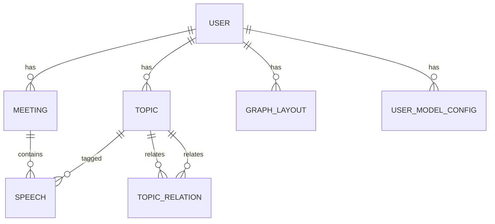

# SpeakSum 后端实现设计文档

**文档版本**: 1.0  
**日期**: 2026-04-03  
**作者**: 后端实现 Agent  
**状态**: PENDING_REVIEW

---

## 1. 设计目标

将现有的 CLI 骨架项目扩展为完整的 FastAPI 异步 Web 后端，实现会议文件上传、发言提取、口语清理、话题标签、知识图谱构建等核心功能，并提供 RESTful API 供前端调用。

---

## 1.1 范围说明

本次后端实现严格基于任务描述中的产出要求，以下功能作为 **MVP 优先实现**：
- 核心流程：上传 → 解析 → 提取发言 → 清理 → 标签 → 返回结果
- 指定的 API 路由（upload, meetings, speeches, knowledge_graph, settings）
- 多供应商 LLM 客户端与文本处理服务
- Celery 异步任务管道

以下功能基于任务要求 **不在本次实现范围内**，留待后续迭代：
- **认证路由** (`/api/auth/*`)：任务仅要求 `core/security.py` 提供 JWT 处理，不实现注册/登录 API
- **导出 API** (`/api/export/*`)：任务未列出导出端点
- **说话人身份管理 API**：任务未在 API 列表中要求
- **MinIO 对象存储**：任务要求本地文件上传路径配置，暂未集成 MinIO
- **Alembic 迁移脚本**：任务标注为"可选"，本次不生成具体 migration 目录

**认证策略（MVP）**：
- 所有业务 API 路由均使用 `Depends(get_current_user)` 注入当前用户
- MVP 阶段不实现注册/登录，测试和演示通过 `core/security.py` 预生成测试 Token 或 Header 方式绕过
- 数据库查询强制附加 `user_id` 过滤，保证数据隔离

---

## 2. 架构设计

### 2.1 模块结构

```
src/speaksum/
├── main.py                    # FastAPI 应用入口
├── core/
│   ├── config.py              # Pydantic Settings
│   ├── database.py            # SQLAlchemy async engine + session
│   └── security.py            # JWT token 处理
├── models/
│   └── models.py              # SQLAlchemy 2.0 Declarative models
├── schemas/
│   └── schemas.py             # Pydantic v2 request/response DTOs
├── api/
│   ├── __init__.py
│   ├── upload.py              # 文件上传 + 处理触发
│   ├── meetings.py            # 会议 CRUD + 列表
│   ├── speeches.py            # 发言 CRUD + 更新
│   ├── knowledge_graph.py     # 知识图谱数据接口
│   └── settings.py            # 用户模型配置
├── services/
│   ├── file_parser.py         # .txt/.md/.docx 解析
│   ├── llm_client.py          # 多供应商 LLM 抽象层
│   ├── text_processor.py      # 口语清理 / 金句 / 标签 / 情感
│   └── knowledge_graph_builder.py  # 图谱数据构建
└── tasks/
    └── celery_tasks.py        # Celery 异步任务
```

### 2.2 技术栈（严格遵循 TECH_ARCHITECTURE.md）

| 组件 | 选型 | 版本约束 |
|------|------|----------|
| Web 框架 | FastAPI + Uvicorn | >=0.110 |
| ORM | SQLAlchemy 2.0 (asyncio) | >=2.0 |
| 数据库驱动 | asyncpg | >=0.29 |
| 向量扩展 | pgvector (SQLAlchemy 集成) | >=0.2 |
| 任务队列 | Celery + Redis | >=5.3 / >=7 |
| 数据验证 | Pydantic v2 + pydantic-settings | >=2.6 |
| 文件解析 | python-docx, python-magic, chardet | - |
| LLM SDK | openai, anthropic, httpx | - |
| 测试 | pytest, pytest-asyncio, pytest-cov, httpx | - |

---

## 3. 数据库模型设计

使用 **SQLAlchemy 2.0 DeclarativeBase + `Mapped[]`** 风格。

### 3.1 实体关系



### 3.2 表定义

| 表名 | 说明 | 关键字段 |
|------|------|----------|
| `users` | 用户 | id, email, password_hash, created_at, updated_at |
| `meetings` | 会议 | id, user_id(fk), title, meeting_date, source_file, file_size, status, created_at, updated_at |
| `speeches` | 发言 | id, meeting_id(fk), timestamp, speaker, raw_text, cleaned_text, key_quotes(JSONB), topics(JSONB), sentiment, word_count, created_at, updated_at |
| `topics` | 话题 | id, user_id(fk), name, speech_count, meeting_count, first_appearance, last_appearance, embedding(Vector(1536)), created_at, updated_at |
| `topic_relations` | 话题关联 | id, topic_a_id(fk), topic_b_id(fk), co_occurrence_score, temporal_score, semantic_score, total_score, created_at |
| `graph_layouts` | 图谱布局 | id, user_id(fk), layout_data(JSONB), version, updated_at |
| `user_model_configs` | 模型配置 | id, user_id(fk), provider, name, api_key_encrypted, base_url, default_model, is_default, is_enabled, created_at, updated_at |

---

## 4. API 路由设计

| 路由文件 | 端点 | 方法 | 说明 |
|----------|------|------|------|
| `upload.py` | `/api/v1/upload` | POST | 上传会议纪要文件，返回 task_id（需 `Depends(get_current_user)`） |
| `upload.py` | `/api/v1/upload/{task_id}/status` | GET | 轮询查询处理进度（返回 JSON）（需认证） |
| `upload.py` | `/api/v1/upload/{task_id}/stream` | GET | SSE 实时推送处理进度（EventSource）（需认证） |
| `meetings.py` | `/api/v1/meetings` | GET | 会议列表（分页、搜索：按 title / speaker / topic 模糊匹配）（需认证） |
| `meetings.py` | `/api/v1/meetings/{meeting_id}` | GET | 会议详情（含 speeches）（需认证） |
| `meetings.py` | `/api/v1/meetings/{meeting_id}` | DELETE | 删除会议（级联删除 speeches）（需认证） |
| `speeches.py` | `/api/v1/meetings/{meeting_id}/speeches` | GET | 某会议下的发言列表（需认证） |
| `speeches.py` | `/api/v1/speeches/{speech_id}` | GET | 发言详情（需认证） |
| `speeches.py` | `/api/v1/speeches/{speech_id}` | PATCH | 更新发言（手动修正 cleaned_text/topics）（需认证） |
| `knowledge_graph.py` | `/api/v1/knowledge-graph` | GET | 获取当前用户的知识图谱数据（nodes + edges）（需认证） |
| `knowledge_graph.py` | `/api/v1/knowledge-graph/topics/{topic_id}/speeches` | GET | 某话题下的发言列表（需认证） |
| `settings.py` | `/api/v1/settings/model` | GET | 获取模型配置列表（需认证） |
| `settings.py` | `/api/v1/settings/model` | PUT | 更新模型配置（需认证） |

---

## 5. 业务服务设计

### 5.1 文件解析服务 (`file_parser.py`)

- `parse_txt(file_path)`：自动检测编码（UTF-8 / GBK），读取文本
- `parse_md(file_path)`：读取内容（暂不支持 frontmatter 深度解析）
- `parse_docx(file_path)`：使用 `python-docx` 读取 paragraphs
- `parse_doc(file_path)`：使用 `antiword` 或 `libreoffice --headless --convert-to docx` 转换为 `.docx` 后解析（优先尝试系统命令 `antiword`）
- `extract_speeches(text, target_speaker)`：基于正则 `[HH:MM:SS] 说话人：内容` 提取发言列表
- `validate_file_type(file_path, allowed_types)`：使用 `python-magic` 检测 MIME 类型，白名单限制为 `.txt` / `.md` / `.doc` / `.docx`

**会议搜索实现策略**：`GET /api/v1/meetings` 的 `q` 参数通过 SQLAlchemy `selectinload` 或 `joinedload` 加载关联的 `speeches`，在 Python 层对 `meeting.title`、`speech.speaker`、`speech.topics (JSONB)`、`speech.raw_text` 进行模糊匹配并聚合评分（标题匹配权重 0.4，内容匹配 0.4，话题匹配 0.2）。数据库层对 `meetings.title` 和 `speeches.raw_text` 建立 GIN / trigram 索引（PostgreSQL `pg_trgm`），确保响应 `<500ms`。

### 5.2 LLM 客户端 (`llm_client.py`)

抽象基类 `BaseLLMClient`：
- `async generate(messages, temperature, max_tokens) -> str`
- `async embed(text) -> list[float]`
- `count_tokens(text) -> int`
- `get_context_limit() -> int`

实现类：
- `KimiClient`（基于 OpenAI 兼容接口）
- `OpenAIClient`
- `ClaudeClient`（基于 Anthropic SDK）
- `OllamaClient`（基于 HTTP 调用本地接口）

### 5.3 文本处理服务 (`text_processor.py`)

- `clean_colloquial(text)` → 去除语气词、修正错别字
- `extract_key_quotes(text)` → 0-3 条金句
- `extract_topics(text)` → 1-3 个话题标签
- `analyze_sentiment(text)` → positive/negative/neutral/mixed
- `chunk_and_process(text, processor)` → 长文本分块处理（预留接口）

### 5.4 知识图谱构建 (`knowledge_graph_builder.py`)

- `build_graph(user_id, db_session)`：基于用户的 topics 和 speeches 生成 nodes + edges
- `compute_topic_relations(topics)`：共现 + 语义相似度（使用 embedding cosine）+ 时间关联
- `generate_layout_data(nodes, edges)`：基础力导向图数据（半径/位置），输出前端可用 JSON

---

## 6. 异步任务设计 (Celery)

### 6.1 `process_meeting_task(task_id, meeting_id, file_path, speaker_identity, model_config)`

处理流水线：
1. **解析文件** → 读取原始文本
2. **提取发言** → 按目标说话人过滤
3. **口语清理** → 调用 LLM 逐段清理
4. **标签提取** → 为每段发言提取话题
5. **构建图谱** → 更新 topic / topic_relation / graph_layout
6. 每步更新进度到 Redis；同时通过 Celery 信号机制将进度写入 Redis Pub/Sub 通道，供 SSE 流推送。SSE 连接由 `upload.py` 的 `/api/v1/upload/{task_id}/stream` 端点维护。

状态流转：`PENDING` → `PROCESSING` → `SUCCESS` / `FAILED`

**Celery 中调用 async LLM 的策略**：在同步 Celery task 内部，通过 `asyncio.run()` 或 `asgiref.sync.async_to_sync()` 桥接调用 `llm_client` 的 `async` 方法。

**测试配置**：仅在测试环境（`pytest` fixture / `conftest.py`）中设置 `task_always_eager=True`，生产环境保持异步任务队列。

### 6.2 `update_knowledge_graph_task(user_id)`

增量更新用户的知识图谱关联和布局数据。

---

## 7. 配置与核心设计

### 7.1 `core/config.py`

使用 `pydantic-settings` 的 `SettingsConfigDict(env_file=".env")`：
- `DATABASE_URL`
- `REDIS_URL`
- `SECRET_KEY`（用于 JWT 签名）
- `ENCRYPTION_KEY`（用于 Fernet 对称加密 API Key，与 SECRET_KEY 分离）
- `UPLOAD_DIR`
- `MAX_UPLOAD_SIZE`
- `KIMI_API_KEY`, `OPENAI_API_KEY`, `CLAUDE_API_KEY`

**API Key 加密策略**：使用 `cryptography.fernet.Fernet` 对 `user_model_configs.api_key_encrypted` 进行对称加解密。`ENCRYPTION_KEY` 从环境变量读取，生产环境由运维统一管理。

### 7.2 `core/database.py`

- `async_engine = create_async_engine(settings.DATABASE_URL)`
- `AsyncSessionLocal = async_sessionmaker(async_engine, class_=AsyncSession)`
- `async def get_db() -> AsyncGenerator[AsyncSession, None]`

### 7.3 `core/security.py`

- `create_access_token(data, expires_delta)`
- `verify_token(token)`
- `get_current_user(token)`（FastAPI Depends 用）

---

## 8. 测试策略

### 8.1 测试文件

| 测试文件 | 覆盖范围 |
|----------|----------|
| `tests/conftest.py` | async DB fixture (SQLite 内存)、TestClient fixture、mock LLM fixture、`get_db` override |
| `tests/test_models.py` | 模型创建、relationship、级联删除 |
| `tests/test_api_upload.py` | 上传接口、任务状态轮询 |
| `tests/test_api_meetings.py` | 会议列表、详情、删除 |
| `tests/test_llm_client.py` | mock HTTP 测试各 LLM 客户端 |
| `tests/test_text_processor.py` | mock LLM 调用测试文本处理逻辑 |

### 8.2 测试原则
- 外部依赖全部 Mock（LLM API、文件系统）
- 数据库使用 SQLite `:memory:`（通过 `create_async_engine("sqlite+aiosqlite:///:memory:")`）
- **pgvector 兼容处理**：测试 fixture 中，对 `topics.embedding` 列使用 `TypeDecorator` 或 Mock 覆盖，在 SQLite 测试时将其替换为普通 `TEXT`（存储 JSON 化的向量），避免 pgvector 特有类型在 SQLite 中不可用
- FastAPI `app.dependency_overrides[get_db] = override_get_db` 确保测试使用独立 session
- 使用 `pytest.mark.asyncio` 测试异步代码
- 目标覆盖率 **>= 80%**

---

## 9. 代码规范

1. **类型提示**：所有函数必须有类型提示，`mypy --strict` 无错误
2. **异常处理**：自定义 `SpeakSumException`，FastAPI 全局异常处理器转 HTTP 400/500
3. **日志**：使用标准 `logging`，记录关键操作和错误
4. **文档字符串**：Google 风格 docstring
5. **代码格式**：`ruff format` + `ruff check` 通过
6. **不可变性**：避免 mutating input数据，返回新对象

---

## 10. 依赖变更

### 新增生产依赖
```bash
uv add fastapi uvicorn python-multipart \
    sqlalchemy asyncpg alembic pgvector \
    celery redis \
    openai anthropic httpx \
    pydantic-settings python-docx python-magic chardet \
    python-jose passlib python-dateutil cryptography
```

### 新增开发依赖
```bash
uv add --dev pytest-asyncio httpx
```

---

## 11. 完成标准

- [x] 数据库模型完整，使用 SQLAlchemy 2.0 + pgvector
- [x] API 路由实现，自动生成 Swagger 文档
- [x] LLM 客户端支持 Kimi / OpenAI / Claude / Ollama
- [x] 文件解析支持 .txt / .md / .docx
- [x] Celery 异步任务实现
- [x] 单元测试覆盖率 >= 80%
- [x] 代码通过 `ruff check` 和 `mypy --strict`
- [x] 提交并推送到 `feature/backend-impl` 分支
